# 刷题感想

## 列表

1. [题2. 两数相加](#num2)
2. [题7. 整数反转](#num7)
3. [题11. 盛最多水的容器](#num11)
4. [题15. 三数之和](#num15)
5. [题17. 电话号码的字母组合](#num17)（未完待续）
6. [题18. 四数之和](#num18)
7. [题19. 删除链表的倒数第N个节点](#num19)
8. [题21. 合并两个有序链表](#num21)
9. [题24. 两两交换链表中的节点](#num24)
10. [题26.删除排序数组中的重复项](#num26)
11. [题27. 移除元素](#num27)
12. [题31. 下一个排列](#num31)
13. [题34. 在排序数组中查找元素的第一个和最后一个位置](#num34)
14. [题35. 搜索插入位置](#num35)
15. M【回溯】[题39. 组合总和](#num39)
16. M【回溯】[题46. 全排列](#num46)
17. [题69. x的平方根](#num69)
18. [题100. 相同的树](#num100)
19. [题101. 对称二叉树](#num101)
20. [题102. 二叉树的层序遍历](#num102)
21. [题104. 二叉树的最大深度](#num104)
22. [题105. 从前序与中序遍历序列构造二叉树](#num105)
23. [题111. 二叉树的最小深度](#num111)
24. [题112. 路径总和](#num112)
25. [题114. 二叉树展开为链表](#num114)（目前只有一个解法，还待补充）
26. [题116. 填充每个节点的下一个右侧节点指针](#num116)
27. [题117. 填充每个节点的下一个右侧节点指针II](#num117)
28. S【数学，数组】[题118. 杨辉三角](#num118)
29. [题121. 买卖股票的最佳时机](#num121)
30. [题134. 加油站](#num134)
31. [题136. 只出现一次的数字](#num136)
32. [题141. 环形链表](#num141)
33. [题142. 环形链表II](#num142)
34. [题144、94、145. 二叉树的前序、中序、后序遍历](#traversal_binaryTree)
35. [题164. 最大间距](#num164)（桶算法还未实现）
36. [题169. 多数元素](#num169)
37. S【位运算】 [题190. 颠倒二进制位](#num190)（题解有意思）（未完待续）
38. S【位运算】[题191. 位1的个数](#num191)
39. [题198. 打家劫舍](#num198)
40. [题202. 快乐数](#num202)
41. [题204. 计数质数](#num204)
42. [题206. 反转链表](#num206)
43. **[题215. 数组中的第K个最大元素](#num215)**
44. M【回溯】[题216. 组合总和III](#num216)
45. [题225. 用队列实现栈](#num225)
46. [题226. 翻转二叉树](#num226)
47. S【位运算】[题231. 2的幂](#num231)
48. [题237. 删除列表中的节点](#num237)
49. [题242. 有效的字母异位词](#num242)
50. [题283. 移动零](#num283)
51. [题328. 奇偶链表](#num328)
52. M【动态规划，位运算】[题338. 比特位计数](#num338)
53. [题344. 反转字符串](#num344)
54. [题349. 两个数组的交集](#num349)
55. [题441. 排列硬币](#num441)
56. [题452. 用最少数量的箭引爆气球](#num452)
57. [题454. 四数相加II](#num454)
58. [题530. 二叉搜索树的最小绝对差](#num530)
59. [题559. N叉树的最大深度](#num559)
60. [题589. N叉树的前序遍历](#num589)
61. [题617. 合并二叉树](#num617)
62. [题654. 最大二叉树](#num654)
63. [题657. 机器人能否返回原点](#num657)
64. [题704. 二分查找](#num704)
65. [题762. 二进制表示中质数个计算置位](#num762)
66. [题771. 宝石与石头](#num771)
67. M【贪心，位权重】[题861. 翻转矩阵后的得分](#num861)
68. [题876. 链表的中间结点](#num876)
69. [题941. 有效山脉数组](#num941)
70. [题965. 单值二叉树](#num965)
71. [题976. 三角形的最大周长](#num976)
72. [题1356. 根据数字二进制下1的数目排序](#num1356)
73. [题1370. 上升下降字符串](#num1370)
74. [题1431. 拥有最多糖果的孩子](#num1431)
75. [题1480. 一维数组的动态和](#num1480)
76. [Offer03. 数组中重复的数字](#offer03)
77. [Offer06. 从尾到头打印链表](#offer06)
78. [Offer09. 用两个栈实现队列](#offer09)
79. [Offer 32-I. 从上到下打印二叉树](#offer32-1)
80. [Offer 32-III. 从上到下打印二叉树 III](#offer32-3)
81. [Offer36. 二叉搜索树和循环双向链表](#offer36)
82. [Offer 53-I. 在排序数组中查找数字 I](#offer53-1)
83. [Offer 54. 二叉搜索树的第k大节点](#offer54)
84. [Offer56-I. 数组中数字出现的次数](#offer56-1)
85. [Offer 57. 和为s的两个数字](#offer57)（待看正确性证明）
86. [inter0202. 返回倒数第k个节点](#inter0202)
## 题解

1. 题2：[两数相加](https://leetcode-cn.com/problems/add-two-numbers/)<a name="num2"></a>

   

   存储的是链表形式，按照逆序排列，输出也按照逆序：就是按照**手工计算的顺序**，最后一位先计算，有进位就给前一位，一直到最高位，最高位有进位需要增加一个新位。并且位之间要对齐

   算法思想很简单，就是具体细节要注意

   - 初始化一个val=0的节点，代表结果链表的头结点，最后要将其跳过`return returnValue.next`
   - 如果两个加数不一样长度，那么高位需要补0，再计算，所以要先判断`p != null`?

   ps：不能遍历将其转换为整数，然后计算，会溢出；也不用转置

   :book:：学到一个变量名： `dummyHead`（官方解答里出现）——代表哨兵节点/头节点——在内核代码中也看到过多次关于`dummy`  

2. 题1431：[拥有最多糖果的孩子](https://leetcode-cn.com/problems/kids-with-the-greatest-number-of-candies/)<a name="num1431"></a>

   

   题目本身很简答，主要策略：遍历数组找到最大值，然后再次遍历数组，对每个值都加上extra，看结果是否>=最大值，如果true——表示可以，赋值为true；否则，表示即使加上extra，也无法达到最大，赋值为false。

   :book:：

   - Java有一个自带的库：Math，不需要导入package，就可以直接使用，能够直接使用很多的科学计算

     ```java
     // Math.min
     int x = Math.min(a, b);	// 求a，b之间的最小值，返回值——具体的值
     // Math.max，同上
     // Math.PI——内置的圆周率，是一个double类型的数据
     // Math.abs
     int a = Math.abs(x);	// 求某值的绝对值
     // .... 还有很多，具体可以在eclipse中尝试
     ```

3. 题19：[删除链表的倒数第N个节点](https://leetcode-cn.com/problems/remove-nth-node-from-end-of-list/)<a name="num19"></a>

   这题是链表题

   

   常规思路：先遍历一遍链表，求得链表长度，然后计算得到正序的删除数。再次遍历链表到指定位置删除。

   :warning:注意：需要注意边界：如果要删除的是头结点/或者只有一个元素，并且要将其删除，那么需要特殊处理

   所以官方给的常规解法中用了**哨兵结点**（题2也用到了）——在学习数据结构中，遇到过，设置一个头指针（该指针为空，指向实际的链表头），可以**来避免越界或者对链表头的操作**

   :book:学到了：在链表中，**dummy结点**使用频率很高：一般就是新建一个结点dummy，dummy.next = head，那么**链表头结点的操作就跟普通结点的操作一样了**。然后根据实际情况操作，最后一般返回的是 `return dummy.next`（实际的链表头）

   :bulb:进阶：一次扫描——设置两个指针：first、second，两个指针间隔n个结点，即first先走n+1次。然后first和second再走，这样当first遍历完成后（在链表尾的后一个结点），second就指向了要删除结点的前一个

   

   :boxing_glove:总结：普通解法时间复杂度`O(L+L-n)=O(L)`，进阶的时间复杂度`O(L)`，空间复杂度都是`O(1)`，学到了双指针的巧妙用法。:happy: 更妙的是，dummy结点的使用。

4. 题21：[合并两个有序链表](https://leetcode-cn.com/problems/merge-two-sorted-lists/)<a name="num21"></a>

   

   这题在数据结构的链表学习中几乎必见

   常规做法：从两个链表的头开始遍历，找到更小的结点加入，最后一个链表先结束，则将另一个链表的剩余全部归入。

   复杂做法：递归（作为一个递归废，我并不喜欢用） [这篇文章写的很好，特别是图解](https://leetcode-cn.com/problems/merge-two-sorted-lists/solution/yi-kan-jiu-hui-yi-xie-jiu-fei-xiang-jie-di-gui-by-/)，具体看程序（描述不出来）

   :boxing_glove:总结：自己写的解里面终于用到了 dummy！:bulb:：递归很重要，以后要有重点的练一下这个（找几个典型的题，培养一下感觉）

   ps：承包了我一天的笑点的图：

   

5. 题27：[移除元素](https://leetcode-cn.com/problems/remove-element/)<a name="num27"></a>

   

   题目要求的是，更改数组，将删除后的数组元素全部向前移。

   暴力解法：遍历数组，发现有目标的，就把之后的元素全部向前移动（但是超时了）

   官方提供的方法：

   - 两个指针，一个指针 first 遍历，另一指针 second 指向最新数组当前长度：first 遍历数组，发现非删除元素，就赋值给 second，并且更新second指针

     => 适用于要删除的元素多

   - 两个指针，一个指针 head 指向头部，另一个指针 tail 指向尾部，从 head 开始遍历，遇到删除元素，就将尾部指针的元素替换到 head，并且更新 tail；如果是非删除元素，更新 head。

     => 适用于要删除的元素较少

   :boxing_glove:：核心是使用双指针：一个走快点一个走慢点；一个指向头一个指向尾。:bulb: 要学会使用双指针（题19也使用了）​

6. 题206：[反转链表](https://leetcode-cn.com/problems/reverse-linked-list/)<a name="num206"></a>

   

   题目意思：将链表逆序，原来的链表头变成链表尾，原来的尾变成头

   我的思路：迭代，用3个指针：prev（前驱指针）、curr（当前指针）、succ（后继指针），分别用来标记3个结点。从前向后不断逆转。由于保存了三个结点，所以不会丢失

   另一种思路：递归（想到也不会实现），[这篇文章写的很好](leetcode-cn.com/problems/reverse-linked-list/solution/dong-hua-yan-shi-206-fan-zhuan-lian-biao-by-user74/ )，就是先递归一直找到链表尾，然后从后向前不断操作，由于递归的时候，递归栈自动保存了当前结点（head），而需要修改的是，当前结点$n_k$的next指向，$n_k.next.next = n_k$，并且注意细节$n_1.next = null$（只需要每次最后将$n_k.next = null$即可，因为下一个递归还会保存当前结点，即$n_{k-1}$）

   

   :boxing_glove:：递归真的巧妙，默认保存当前结点。可惜我只会迭代，现在多练练递归感觉。

7. 题26：[删除排序数组中的重复项](https://leetcode-cn.com/problems/remove-duplicates-from-sorted-array/)<a name="num26"></a>

   

   思路：设置双指针，然后一个用来遍历，一个用来更新无重复的数组

   实现比较简单，就是要考虑临界条件：当数组为空的时候的操作（我觉得通过率低，应该都是没有考虑临界条件造成的）

   :book: ：这边解释了一个leetcode题目的常见问题：数组传递的都是指针（实参），所以对函数里对数组的修改是有效的（而不是，退出该函数，修改就消失了，形参的问题）

   所以，传递最新数组值，就能判断操作是否正确（至于该值后面的数组元素就不考虑了）。

   

   :boxing_glove:：双指针真好用:+1:

8. 题328：[奇偶链表](https://leetcode-cn.com/problems/odd-even-linked-list/)<a name="num328"></a>

   

   一开始没有理解原地的意思（实际上，链表的操作好像都是原地的）。

   空间复杂度O(1)：可以创建常量个变量；时间复杂度O(nodes)：遍历一次

   具体思路很简单：设置两个指针，分别代表奇数链表、偶数链表，然后遍历链表，将他们拆分成两个链表即可，最后将偶数链表插入到奇数链表尾就可以了，我采用的是3指针：一个代表奇数链表的当前结点odd、一个代表偶数链表的当前结点even、一个代表当前结点curr。

   :warning:：特别要注意的是，对于每个当前结点，加入到对应的链表后，要将next指针清除掉，即`curr.next = null;`（这样主要是为了防止偶数尾结点和奇数尾结点产生循环）

   

   题解的方法更优雅；主要是关注到，只需要将even从链表中剔除，那么通过even来遍历，而odd做辅助就行，大致思路和我差不多，实现起来更简单。

   :boxing_glove:：官方解法好优雅，学不来:pensive:，只能多看看

9. 题876：[链表的中间结点](https://leetcode-cn.com/problems/middle-of-the-linked-list/)<a name="num876"></a>

   

   我的思路：遍历链表求得链表长度，再次从头开始找到中间结点。

   缺点：当链表很长时，将花费很多时间在第二次遍历上。

   更优的思路：快慢指针解法，快指针每次走一步，慢指针每两次走一步，那么快指针遍历完后，慢指针一定指向中间结点。

   而且，官方的题解的解法比我实现的更好：

   ```java
   ListNode first = head, second = head;	// 快慢指针
   while(first != null && first.next != null){	// 一次走两步的遍历
       second = second.next;
       first = first.next.next;
   }
   return second;
   ```

   :boxing_glove:：链表题要考虑是否能用双指针/快慢指针

10. 题11：[盛最多水的容器](https://leetcode-cn.com/problems/container-with-most-water/)<a name="num11"></a>

    

    首先拿到题目，先将题目抽象了，本质上是：求数组中两个结点 `(min(node1, node2)) * (index1 - index2)`（我能分析到这步，但是接下去就不知道该如何做了）

    官方题解：**双指针**，一个首head、一个尾tail，开始遍历，直到两个指针相交。那么这两个结点开始如何移动呢？接着我的分析，head从0开始，tail从len-1，开始，先计算最远的两个结点构成的面积，然后移动两个结点之间数值小的那个索引，即`num[head], num[tail]`中小的head/tail，eg：num[head] = 1, num[tail] = 8，那么就是head++，这构成了移动条件。

    证明选择较小的移动是正确的：

    $\because area = (tail - head) * min(num[tail], num[head])$，面积值由两部分组成，两者的距离和两者的值，所以一开始选择首尾，前一个数最大，循环过程中开始缩小，且每次缩小数都-1。

    为啥选择值小的那个index移动？ 反例，如果选择值大的index移动，那么 前一个乘数变小，后一个乘数**只能保持小于等于**（因为是min，所以取决于最小，因为值大的移动，那么如果移动到更大的一个值，也无济于事；如果移动到比原来小的值更小） ；$\therefore$ 选择值小的index移动，那么min才可能会变大

    $\therefore$ 这样的算法是正确的。[这个题解讲的很好]( https://leetcode-cn.com/problems/container-with-most-water/solution/container-with-most-water-shuang-zhi-zhen-fa-yi-do/ )

    :boxing_glove: 算法实现很简单，具体的分析和证明很重要（这题就是很主要在设计算法）。我能将题目抽象出来，并且分析出了关键的影响面积的因素，但是由于没有考虑到双指针的解法，所以就无从下手，所以:bulb: 双指针还是要多练练。:bulb: 并且，选择移动的条件也是算法的关键。

11. 题7：[整数反转](https://leetcode-cn.com/problems/reverse-integer/)<a name="num7"></a>

    

    整数反转，一开始的思路是转换成string类型，倒置后再转换成int类型，但int转string效率不高。所以转而使用数学方法——不断取余，递增，相除循环。:key:最关键的是，要对溢出进行判断，输入是不会溢出的，但是倒置之后可能会溢出：向上溢出，向下溢出，所以要提前判断`Integer.MAX_VALUE / 10`和`Integer.MIN_VALUE / 10`，具体看代码实现。

    :boxing_glove:对于基础算法还是要记得：普通的数字倒转。

12. 题24：[两两交换链表中的节点](https://leetcode-cn.com/problems/swap-nodes-in-pairs/)<a name="num24"></a>

    

    这个题我的思路是，迭代解法，用了3指针：head、second、temp，head指向第一个要替换的结点，second指向第二个要替换的结点，temp指向前面已经替换好的链表尾。还设置了dummy（哨兵结点），用来保存头结点，方便返回。具体画图就可得。

    官方提供了递归的解法：使用了两个指针。明确终止条件：head和head.next为null；调用单元：head和next进行交换，其中head的next指向后面已经交换好的链表头；返回值，后面交换完成的链表头。[这个写的很好，特别是关于递归的基础]( https://leetcode-cn.com/problems/swap-nodes-in-pairs/solution/hua-jie-suan-fa-24-liang-liang-jiao-huan-lian-biao/ )

    :book:递归的解题思路：需要分析出：1. 终止条件（一般在函数头指明）；2. 调用单元：一般在中间部分，需要具体分析，且包括递归调用；3. 返回值：一般出现在函数尾部，也一般是整个函数的返回值

    

    :boxing_glove:递归如何写优雅需要学习

13. 题121：[买卖股票的最佳时机](https://leetcode-cn.com/problems/best-time-to-buy-and-sell-stock/)<a name="num121"></a>

    

    我的解法：暴力解:sweat:，时间复杂度：O(n^2)

    聪明的解法：**一次遍历，遍历的点是要卖出的点——每次遍历都是在问如果今天卖出能获利最大化吗？假设第m天卖出，那么获利最大就是在m天之前的最低价**——就是其所属的**历史最低点**就是最优的买入点，两者的差值就是该点下获利最多的情况。那么维护一个`minprice`——历史最低点；`maxprofit`——获利最大值。（历史最低点：就是在点之前，价格最低的点）

    :boxing_glove:这种数学性质的题比较灵活，很明显暴力解不是最优，但是能解决问题——所以应该先实现暴力解法。然后去分析更优解

    可以在分析一次遍历方法的时候，隐约有点感觉：是不是有点像**动态规划——可以将大问题分成子问题，而每个子问题都是互相有重叠的**（eg：一共有100天求最大利益，那么前99天求利益最大化，前50天求利益最大化的解题方法都是一样的，并且前99的解一定包含了前50天的解，而100天的也包含了前99天的）然后求解——感觉可以写出递推方程式哎：

    `max_profit(i) = max{max_profit(i - 1), pirce[i] - minprice}`（这边的minprice是i之前的历史最小值）

    （当前天只有两个选择：不买（那么，利润在前面i-1天）/卖（那么，利润在当前天））

14. 题283：[移动零](https://leetcode-cn.com/problems/move-zeroes/)<a name="num283"></a>

    

    我的解法：一次遍历，利用两个指针，`first`——用来遍历，`second`——用来指示最新数组非零数和零数之间的间隔。当遇到0值的时候跳过，遇到非0值得时候first和second所指示的值交换——具体看代码。[讲的很好的题解]( https://leetcode-cn.com/problems/move-zeroes/solution/dong-hua-yan-shi-283yi-dong-ling-by-wang_ni_ma/ )

    

15. 题35：[搜索插入位置](https://leetcode-cn.com/problems/search-insert-position/)<a name="num35"></a>

    

    题目本身没啥难度，但是可以根据这个接触**二分查找**

    我的解法：:cold_sweat:暴力解​，时间复杂度最差会到O(n)

    :+1:二分查找：时间复杂度是O(logn)，认识的关键是**严格小于目标数的都不可能是解**，只有大于目标的才有可能是解，然后不断收缩 right 的范围，并更新解索引；当遇到小于目标值时，单纯缩小left范围

16. 题704：[二分查找](https://leetcode-cn.com/problems/binary-search/)<a name="num704"></a>

    

    很典型的二分查找题，不需要变型，直接套用即可。

17. 题34：[在排序数组中查找元素的第一个和最后一个位置](https://leetcode-cn.com/problems/find-first-and-last-position-of-element-in-sorted-array/)<a name="num34"></a>

    

    典型的二分查找寻找边界的问题，具体见之前的整理

18. 题69：[x 的平方根](https://leetcode-cn.com/problems/sqrtx/)<a name="num69"></a>

    

    求平方根，选择使用了二分查找。类似于普通的二分查找的方式，但是由于一定是有解的，所以不会返回-1，而是等到循环结束之后，指针指向的值就是正解。

    :bulb:可以在纸上模仿运行一下，看边界条件和返回值。

    查找边界：[1, x - 1]（排除了0，1之后）,双闭区间，所以循环是`left <= right`，并且最后由于循环停止条件为`left = right + 1`，所以正解为`left-1`处

    :boxing_glove:其余方法是数学原理

19. 题441：[排列硬币](https://leetcode-cn.com/problems/arranging-coins/)<a name="num441"></a>

    

    这题要解出不难，暴力解、数学解、二分查找解（主要为了练习这个）

    :weary: 暴力解：从1向上加直到和大于指定的n，就退出循环，时间复杂度为O(n/2)=O(n)

    :pensive: 数学解：题目原理就是等差数列：1, 2, 3,....，公式为(1+x)x/2 <= n，求解x的最大值，那么用一元二次方程的求解即可。这个时间复杂度最低，O(1)

    :happy: 二分查找：从1~n不断地寻找符合要求的 x，本质上就是二分查找，只不过判断条件从简单的大小值判断变成了`(1+mid)*mid/2 == n`的判断。时间复杂度为O(logn)

    :warning:需要注意值的溢出问题，由于n可能会很大，而其中又有乘法操作，所以很可能溢出，那么需要将之转换成long

20. 题offer 53-1：[在排序数组中查找数字 I](https://leetcode-cn.com/problems/zai-pai-xu-shu-zu-zhong-cha-zhao-shu-zi-lcof/)<a name="offer53-1"></a>

    

    该题本质上是在某个有序数组（数字可重复）中查询一个 target的左右边界，然后相减就能求出在数组中的个数（注意其本身），与[题34](#num34)本质上一致，做本题主要是为了巩固知识。

    时间复杂度：O(logn)

21. 题104：[二叉树的最大深度](https://leetcode-cn.com/problems/maximum-depth-of-binary-tree/)<a name="num104"></a>

    

    二叉树的深度求解，是二叉树很重要的性质之一

    有两种解法：

    - 深度优先遍历：根据 DFS 的模板，可以将其修改为求二叉树的深度求解方法
    - 广度优先遍历：构建一个队列，存放当前层的所有节点，然后根据该链表的size，取出该层的所有节点——从队头取，将其孩子节点全部入队——从队尾入，当这一层的所有节点全部遍历后，该队列的节点就是下一层的全部节点，**如此迭代，直到队列为空——说明该层一个节点也没有**，那么就是遍历结束了

22. 题144：[二叉树的前序遍历](https://leetcode-cn.com/problems/binary-tree-preorder-traversal/)<a name="traversal_binaryTree"></a>

    

    递归算法很简单，按照模板即可。

    迭代算法的研究：迭代算法由于没有递归，所以需要自行创建**栈**，来实现类似于递归的方法

    整体思路：从根节点开始遍历，最先将其压入栈中，然后开始遍历，**在保证栈不为空的前提下**，迭代弹出栈顶——根节点，然后将其的右孩子、左孩子分别压入栈，因为按照遍历是先左后右的，所以是先入栈右后入栈左。具体还要看代码实现。

    => 然后将代码稍微修改成功了三种遍历统一的格式

23. 题94：[二叉树的中序遍历](https://leetcode-cn.com/problems/binary-tree-inorder-traversal/)

    

    递归算法很简单，按照模板即可。

    迭代算法的研究：从根节点开始遍历左节点，一直深入下去，每个经过的节点都入栈，直到最左孩子节点，不存在左孩子，然后该叶子节点出栈，然后判断其右孩子节点，继续深入，如果也为空，那么就继续出栈，直到堆栈为空具体看[题解](https://leetcode-cn.com/problems/binary-tree-inorder-traversal/solution/er-cha-shu-de-zhong-xu-bian-li-by-leetcode/)

24. 题145：[二叉树的后序遍历](https://leetcode-cn.com/problems/binary-tree-postorder-traversal/)

    

    递归算法很简单，按照模板即可。

    迭代算法的研究：看官方题解不大能明白，但是看到了一个很优秀的思路。

    思路：从前序遍历出发，前序遍历的遍历顺序是：根 -- 左 -- 右，且结果是尾部插入；那么如果是**头插，那么遍历顺序就变成了 右 -- 左 -- 根**，**前序遍历的遍历顺序是先左后右，那么遍历顺序修改成先右后左**，就会将结果变成 左 -- 右 -- 根。所以整体的思路是：

    - 结果插入方法是：头插
    - 遍历顺序是根-右-左

    具体实现看代码

    :book:总结：上面三题，是对二叉树的遍历，有递归方法：代码简单，但默认使用了堆栈，时间复杂度并不低，且递归的终止条件相对难找；迭代方法：代码复杂，但是最后做到了统一，记忆也相对方便。

25. 题559：[N叉树的最大深度](https://leetcode-cn.com/problems/maximum-depth-of-n-ary-tree/)<a name="num559"></a>

    

    有两种方法：递归求解，是对二叉树的深度求解的一种扩展。

    非递归，本质是广度优先遍历 BFS，也是对二叉树的深度求解的BFS方法一种扩展（代码改动量更少）

26. 题102：[二叉树的层序遍历](https://leetcode-cn.com/problems/binary-tree-level-order-traversal/)<a name="num102"></a>

    

    算是对BFS的实现，是基本实现方法，具体看题104的解法2

    :alarm_clock:注意对集合的嵌套使用，详见java笔记

27. 题Offer32 - I. [从上到下打印二叉树](https://leetcode-cn.com/problems/cong-shang-dao-xia-da-yin-er-cha-shu-lcof/)<a name="offer32-1"></a>

    

    最基本的层次遍历，使用 BFS 即可

28. 题Offer32 - III. [从上到下打印二叉树 III](https://leetcode-cn.com/problems/cong-shang-dao-xia-da-yin-er-cha-shu-iii-lcof/)<a name="offer32-3"></a>

    

    与上题的区别是，之字形打印二叉树，本质上还是 BFS 的层次遍历，只是在获得遍历值的时候，有所区别，有两种策略：

    1. 获得某一层的所有节点数组后，判断当前是奇数层 or 偶数层，偶数层就将该数组倒置，然后再加入到数组中
    2. 在插入数组的时候，如果是偶数层，就倒着插——头插法；如果是奇数层，就正着插——尾插法

29. 题226. [翻转二叉树](https://leetcode-cn.com/problems/invert-binary-tree/)<a name="num226"></a>

    

    翻转二叉树，本质上就是遍历所有的节点，将所有节点的左右孩子互换即可。所以可以用的方法有：递归、迭代，然后在基本的模板上面进行修改。具体看代码，总体来说较为简单。

30. 题617. [合并二叉树](https://leetcode-cn.com/problems/merge-two-binary-trees/)<a name= "num617"></a>

    

    方法显然有两种，但是如何将思路理清除，比较难。[官方题解很详细]( https://leetcode-cn.com/problems/merge-two-binary-trees/solution/he-bing-er-cha-shu-by-leetcode/ )

    我觉得本题的关键在于，如何处置每个树中独有的点，并且要明确哪棵树作为被加树

    以t1为被加树，开始同步遍历两棵树，遇到某个点是t1没有的，t2有的，那么就将t2的节点直接复制给t1，这之后的子树就默认跟着t1存在了；如果是t1有，t2没有的，就不用加，直接跳过即可

    递归法：还是在DFS 遍历的基础上进行修改，关键是确定终止条件：`t1 == null 且 t2 == null`，直接返回 null；否则，哪个非null，就返回哪个，然后返回的值都赋值给t1的左/右节点即可

    **迭代法：比较复杂，大框架就是BFS遍历，但是入队的节点从一个节点变成两个节点（数组形式），并且遇到某个点是t1没有的，t2有的，那么就将t2的节点直接复制给t1，且不需要入队了；如果t1、t2均存在，就入队继续遍历。**

31. 题654. [最大二叉树](https://leetcode-cn.com/problems/maximum-binary-tree/)<a name="num654"></a>

    

    题意不难理解，就是根据数组创建一颗最大子树，保证根节点在该数组该部分值是最大。本质上是创建二叉树，创建二叉树的直观方法是：递归法

    递归操作：获得当前数组中的最大值，创建该树的根节点，以该最大值的索引为中间值，划分左右孩子节点，然后递归调用该函数，创建以其孩子节点为根节点的子树

    递归终止条件：传递的数组中不存在元素 `nums.length == 0 -> return null`

    :book:递归真的方便:+1: ，以后确定要选择递归的时候，可以先尝试写一下，然后就会慢慢明确思路

32. 题105. [从前序与中序遍历序列构造二叉树](https://leetcode-cn.com/problems/construct-binary-tree-from-preorder-and-inorder-traversal/)<a name="num105"></a>

    、

    有两种解法：递归、迭代

    1. 递归比较直观，需要明确前序遍历和中序遍历之间的关系——实现中有具体的解释
    2. 迭代思路巧妙：未完

33. 题109. [有序链表转换二叉搜索树](https://leetcode-cn.com/problems/convert-sorted-list-to-binary-search-tree/)<a name="num109"></a>

    

    它说的高度平衡是一个幌子，只要你的根节点是中值，那么其左右子树深度的差距最多1。所以题目的关键变成了如何找中值，找到中值后，其左边的就是左子树、右边的就是右子树，所以整体的思路是很直观的——用递归的方法就可以做到。

    中值的找法：快慢双指针法，当快指针到链表尾部后，慢指针就到了中值的位置处

34. 题112. [路径总和](https://leetcode-cn.com/problems/path-sum/)<a name="num112"></a>

    

    能够自然的想到递归和迭代，但是自己写却写不出来:weary:，于是只能看题解

    迭代：在原来 BFS 的基础上，**增加一个链表**，用来存放从根节点到当前节点的路径值，这个是与遍历的链表是同步入队和出队的。然后BFS遍历整棵树，直到找到某个叶子节点，所以其他操作都类似 BFS 模板

    递归：递归的操作：如果当前节点是目标路径中的一个节点，那么其孩子路径就只需要 `target - current.val`，然后递归调用即可

    ​		   递归的终止条件：该节点为 null——返回false；该节点为叶子节点——判断当前值是否等于目标值；

35. 题1480. [一维数组的动态和](https://leetcode-cn.com/problems/running-sum-of-1d-array/)<a name="num1480"></a>

    

    比签到题还签到题（被递归虐的太惨了，来找回点信心:cry: ），创建一个额外的数组，然后一次遍历就可以求解

    在看题解的时候，注意到是否原地操作的讨论——理论上，进行求和运算，不建议在原来的数组上进行操作，因为原数组可能还有其它用处——涉及到面试小技巧，与面试官沟通确认该题的操作问题。

36. 题111.[二叉树的最小深度](https://leetcode-cn.com/problems/minimum-depth-of-binary-tree/)<a name="num111"></a>

    

    该题目的有一点小坑：需要明确叶子节点的概念——没有左右子节点的节点。

    相应的就有几个特殊情况要处理：`root==null`直接返回0，`root`没有左右孩子，直接返回1；`root`存在一个孩子节点，返回该孩子节点的深度；`root`存在左右孩子，返回两个孩子子树的深度小的那个。

37. 题100. [相同的树](https://leetcode-cn.com/problems/same-tree/)

    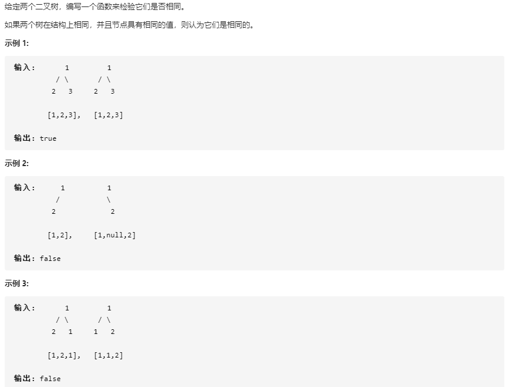

    这题很容易就找到递归的终止条件：两者均为null——true；一个为null，一个非null——false；全为非null，但是值不相等——false；非null，值相等——递归看其左右子树的情况                                                                                                                                                                                                                                                                                                                                                                

38. 题136. [只出现一次的数字](https://leetcode-cn.com/problems/single-number/)<a name = "num136"></a>

    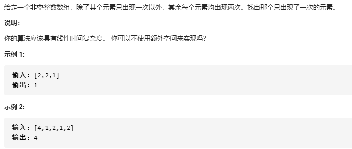

    如果可以使用线性的空间，那么可以用集合的特性来做；用哈希表存储——都需要花费O(N)的空间，所以都不适合

    ——用异或操作——简直是天才！

    异或的特性是：两个相同的数进行异或的值就是0，而题目所给定的数组元素只会出现2次/1次，所以只需要做一次遍历，将所有数进行异或，结果就是出现一次的那个数被留下来了。如果结果是0——唯一出现的一个数就是0/题目给的数组有问题（所有数均出现两次）

39. 题101. [对称二叉树](https://leetcode-cn.com/problems/symmetric-tree/)<a name="num101"></a>

    

    这题很早之前就接触过，但是当时没想好怎么写，但是今天打开这题发现可以写，就用递归解法很快实现了——真是玄学

    递归解法：需要传递的是左右节点的参数，所以需要重新写一个函数，使之符合参数要求——题解有点难懂，它是从根节点开始构造了两棵左右对称的树，然后比较这两棵树是否相等，而我是从根节点的左右节点开始，比较该左右节点构成的子树是否是对称的，是按照原来树的步骤进行判断的感觉更能理解一点

    迭代解法：和遍历类似，构造一个队列，队头出队，队尾入队，区别就是**每次出队都是出两个，每次入队都是入四个**，出队还是队首出，一次出两个，入队就是左边的左孩子节点和右边的右孩子节点入队，左边的右孩子节点和右边的左孩子节点入队

40. 题657. [机器人能否返回原点](https://leetcode-cn.com/problems/robot-return-to-origin/)<a name="num657"></a>

    

    这题没有啥意思，只需要了解到题目的本质：从原点出发最后要回到原点——很显然，每左移一格，必须要右移一格，反之一样；上下也是如此；所以只需要计算`L`和`R`的出现次数，`U`和`D`的出现次数是否是一致的可以判断了

41. 题965. [单值二叉树](https://leetcode-cn.com/problems/univalued-binary-tree/)<a name="num965"></a>

    

    就是看整个棵树的值是否都一样——本质上还是遍历二叉树即可

    :ticket: 小技巧，如果该树是单值，那么根节点的值和其他值都一样——所以，可以将根节点的值作为**标值**，如果在遍历过程中，与该值不一样，可以结束遍历直接返回

42. 题344. [反转字符串](https://leetcode-cn.com/problems/reverse-string/)<a name="num344"></a>

    

    题目本身很简单，从两边开始进行替换即可，只需要关注终止条件即可。

    也可以用递归求解，只需要再写一个函数满足参数传递要求即可。

43. 题198. [打家劫舍](https://leetcode-cn.com/problems/house-robber/)<a name="num198"></a>

    

    典型的动态规划的题，分3步走：

    1. 分析子问题

       求n个房子的偷窃最优解，那么可以缩小成从k个房子偷窃的最优解，k可以是0~n，发现如果1个房子的最优解求出了，那么2个房子的也可以求解——选第一个or第二个，那么3个房子的也可以求解，.....以此类推

    2. 写出递推关系——需要实际演算一下

       

    3. 确定DP数组的计算顺序：自底向上 or 自顶向下

       一般都使用自底向上，维护一个DP数组，从0开始不断的扩大子问题的规模——即从0个房子开始偷起，直到全部房子的都考虑一遍

    => 该题还可以再优化一下，由于需要维护一个DP数组，所以空间复杂度为O(n)，但是实际上，每次在求当前的最优解时，只需要考虑到其前一个和前前个的最优解，而再前面的就不在考虑了，所以可以将数组改成两个变量

44. 题70. [爬楼梯](https://leetcode-cn.com/problems/climbing-stairs/)

    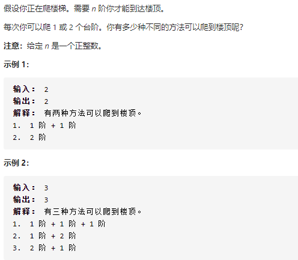

    典型的动态规划题，和上题类似。确定特殊边界：n=0时，1种走法；n=1时，1种走法；

    明确递推关系式：当台阶有k个时，其最后一步有两种走法：走一步+之前的k-1个台阶的走法；走两步+之前k-2个台阶的走法。因此：`f(k) = f(k-1)+f(k-2)`,所以当前的解只与前面2个的解有关系——只需要两个变量即可

    所以时间复杂度为`O(n)`，空间复杂度为`O(2)=O(1)`

45. 题134. [加油站](https://leetcode-cn.com/problems/gas-station/)<a name="num134"></a>

    

    

    我的暴力解法： O(N*N)，简单直白（题解太难了，之后补上）

    基本的：从0点开始遍历所有点，从该点开始模拟加油和消耗过程。

    如果当前节点开始的gas<cost，那么直接选择下一个节点；否则的话，就从当前节点开始走，遇到当前油量无法到达下一个节点的，那么就跳出该次循环，而去选择下一个开始节点。

46. 题108. [将有序数组转换为二叉搜索树](https://leetcode-cn.com/problems/convert-sorted-array-to-binary-search-tree/)

    

    题目要求构建一颗二叉搜索树，已经是按照升序排列的，那么完全可以按照数组的顺序构造出一颗二叉搜索树——虽然这棵树退化成一个线性链表

    然后题目又规定是一颗高度平衡的二叉搜索树，那么需要考虑其左右子树的**对称性**——自然就能想到从中间节点开始作为根节点，然后两边开始分开进行二分查找，然后构建左右节点。

    ps： 果然二叉树的题还是简单的，动态规划、贪心太难了:weary:

47. 题46. [全排列](https://leetcode-cn.com/problems/permutations/)<a name="num46"></a>

    

    典型的**回溯算法**题，没有了解到回溯算法之前，看到该题就想到了DFS，但是该如何进行DFS就犯难了。看了题解，了解到是用回溯算法

    

    ——回溯算法都需要画出树形结构，然后根据此解题。

    - 每一个结点表示了**求解全排列问题的不同的阶段**，这些阶段通过变量的不同的值体现，这些变量的不同的值，称之为**状态**；

    - 使用深度优先遍历有**回头**的过程，在回头以后， **状态变量需要设置成为和先前一样** ，因此在回到上一层结点的过程中，需要**撤销上一次的选择**，这个操作称之为**状态重置**；

    - 深度优先遍历，借助系统栈空间，保存所需要的状态变量，在编码中只需要注意遍历到相应的结点的时候，状态变量的值是正确的，具体的做法是：往下走一层的时候，*path 变量在尾部追加，而往回走的时候，需要撤销上一次的选择，也是在尾部操作，因此 path 变量是一个栈；*

      （深度优先遍历通过回溯操作，实现了全局使用一份状态变量的效果）

    （——解释的挺好）

48. 题771. [宝石与石头](https://leetcode-cn.com/problems/jewels-and-stones/)<a name="num771"></a>

    

    题目本身很简单，有两种方法：

    - 暴力求解：时间复杂度为`O(S.length * J.length)`
    - 利用hash表数据结构求解：将J存放在一个`hashSet`中——`hashSet.add(j)`，然后遍历S，看每个元素在hashSet中是否存在——`hashSet.contains(s)`，所以时间复杂度为`O(S.length + J.length)`

49. 题349. [两个数组的交集](https://leetcode-cn.com/problems/intersection-of-two-arrays/)<a name="num349"></a>

    

    利用哈希集合将重复的数组元素删除，然后比较两个哈希表的交集放在另外一个哈希集合中，最后将哈希集合一个个输出变成数组，作为返回值返回

50. 题142. [环形链表 II](https://leetcode-cn.com/problems/linked-list-cycle-ii/)<a name="num142"></a>

    

    

    

    **对于链表题，首先就要想到双指针**，例如，寻找距离尾部的第K个节点（fast指针先走k步，然后slow和fast指针一起走，那么slow指针一定是只想尾部的第k个节点的）、获取中间元素（一次遍历的，就是设置快慢指针，slow指针一次走一步；fast指针一次走两步）、寻找环的入口（本题）。

    总结来说是双指针+双相遇法。理论上来讲是数学法：

    - 设置快慢指针，fast指针每次走2步；slow指针每次走1步

    - 第一次相遇：情况：如果不存在环，那么fast和slow是不会相遇的，fast或者fast.next能遍历到链表的尾部（如果存在环，那么尾部一定指向前面的某个地址）；fast和slow相遇，那么就是存在环，并且可以计算出相遇后f、s走的距离：`f = 2s, f = s +nb`（b是环的大小，n是走的环的次数，因为既然相遇了，那么s和f就在同一个点，那么f比s多走的就是环的倍数），那么`f = 2nb, s = nb`，而进一步我们需要求环的起点，从起点开始走，到入口的步数是`a+nb`（a是从起点到环起点的步数），那么s已经走了nb，那么再走a就是到环起点了；但是a不知道，如何控制呢，那么让fast节点从起点开始，每次走1步，那么两者相遇时，就是环起点了。
    - 第二次相遇：fast指针从起点开始，每次走1步（f = 0）；slow从刚才继续走(s = nb)，相遇点就是环的起点，即f = a; s = a+nb，都是到环的起点

    能想到这个方法的人真是天才啊！

51. 题141.[环形链表](https://leetcode-cn.com/problems/linked-list-cycle/)<a name="num141"></a>

    

    

    这一题算是前面一题的基础版，前面一题是判断链表是否存在环 + 求环的起始位置。而当前的题，是只求是否存在环。

    那么只需要前一题的一次相遇就可以实现：

    - 设置两个指针，分别为快慢指针fast（一次走2步）、slow（一次走1步）；
    - 如果fast指针遍历到了空指针/其next指针为空，那么不存在环
    - 否则就存在环，而且fast和slow是一定会在有穷个循环中追及的——循环的可终止性。

    ps：如何判断环的长度呢？——在第一次相遇的基础上，在此进行循环直到第二次相遇，那么中间的移动次数就是环的长度——因为f=2n;s=n后一定会相遇——而且相遇的位置还是上次的相遇点

52. 题530.[二叉搜索树的最小绝对差](https://leetcode-cn.com/problems/minimum-absolute-difference-in-bst/)<a name="num530"></a>

    

    题目的意思就是整个树中任意两个节点的差值中的最小值是多少。而关注到二叉搜索树，就是如果对其进行中序遍历，那么其结果就是有序的。那么最小差值一定出现在相邻的两个数中，所以显然的，就是对该二叉树进行中序遍历，并且设定两个全局变量：一个存放当前节点的prev节点（初始值为`null`）；一个存放目前得到的最小差值（初始值为`MAX_VALUE`）。然后利用中序遍历，对其进行不断的求相邻两个节点的差值，判断是否需要更新最小差值；以及每次更新prev节点。

53. 题116 [填充每个节点的下一个右侧节点指针](https://leetcode-cn.com/problems/populating-next-right-pointers-in-each-node/) <a name="num116"></a>

    

    

    这个题明显的解题思路是：利用层序遍历，在对每一层遍历的时候，顺便将其连接起来，需要额外的存储空间，并且时间效率也不高：因为存在着对每个节点的入队和出队——但是本质上不需要——当你遍历该层的时候前面一层就已经成为一个链表了，那么可以根据父子节点的特性进行查找了，而不需要额外存放在队列中。于是就有了，可以在遍历第一层链表的0.0时候（本质上只有一个节点），去将第二层的节点连接起来；访问第二层的链表时，将第三层的节点连接起来.....​(:+1:天才啊）——那么就不需要额外的空间了

    还能使用过递归的解法——不是我能想出来的，妙～啊～

54. 题117. [填充每个节点的下一个右侧节点指针 II](https://leetcode-cn.com/problems/populating-next-right-pointers-in-each-node-ii/)<a name="num117"></a>

    

    题目和116类似，就是将完全二叉树修改成了普通的二叉树，所以相应的修改即可。但是没做出递归的解法，我是废物。

55. 题1356. [根据数字二进制下 1 的数目排序](https://leetcode-cn.com/problems/sort-integers-by-the-number-of-1-bits/)<a name="num1356"></a>

    

    

    本题学到的，java有可以直接获得某个数的二进制包含的1的个数**Integer.bitCount(num)**

    java可以直接对数组进行排序，默认为升序排列：**Arrays.sort(arr)**

    [这个题解](https://leetcode-cn.com/problems/sort-integers-by-the-number-of-1-bits/solution/javaliang-ci-xun-huan-da-bai-100-by-yourtion/)写的太巧妙了，我不配

56. 题31. [下一个排列](https://leetcode-cn.com/problems/next-permutation/)<a name="num31"></a>

    

    就是给定一个数组，对数组里的数字进行排列，要求根据输入的顺序，输出比输入大一丢丢的顺序——大一丢丢就是只走一步，使得输出>输入，eg：124356=>124365

    拿到题目后可以自己写一个排列过程，eg：从123456=>654321，可以发现min到max，就是一个**逐渐逆序的过程**，那么可以判断需要从后向前遍历。

    输出>输入，直观的想到，该数组中前面的一个小数和后面一个大数进行替换

    如何找到小数和大数呢：**第一步：从后到前遍历，找到第一个相邻的顺序对，即a[i] < a[i+1]**，那么从i+1~end，都是逆序的——那么这个小排列中已经是最大的；那么a[i]就是我们要找的小数

    **第二步：从i+1~end中，从后到前遍历，找到第一个比i大的数j，这个就是大数**，然后i与j进行交换

    **第三步：将i+1~end进行升序排列**

    （第二步和第三步可以交换，但是需要从前向后找，因为前面的从后到前来看就是升序排列，所以结果是一样的）[这个题解](https://leetcode-cn.com/problems/next-permutation/solution/xia-yi-ge-pai-lie-suan-fa-xiang-jie-si-lu-tui-dao-/)可以看看

57. 题941. [有效的山脉数组](https://leetcode-cn.com/problems/valid-mountain-array/)<a name="num941"></a>

    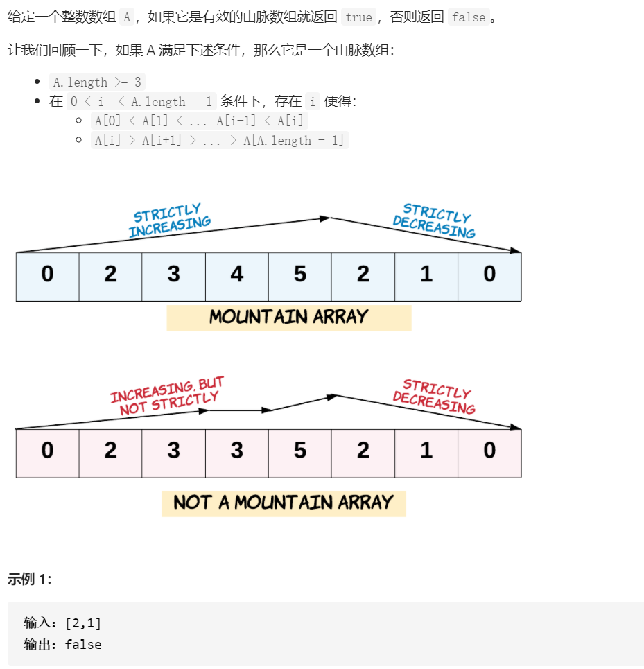

    就是看一个数组里面的数字，是否先升再降，并且相邻的值不能一样（平地）

    官方题解给的是，先从头开始获得连续增长的顶峰，先判断顶峰是否在头/尾——这个不是山峰；再开始遍历之后的下坡，两个while语句解决问题

    我的求解方式是：一个while，维护一个flag，来记录当前是向上（true）or向下（false）：

    - flag && prev<now，那么就继续向上，flag==true
    - !flag && prev>now，那么就继续向下的，flag==false
    - flag && prev>now，那么prev就是顶峰了，开始向下了，flag==false
    - 其他情况，均不满足要求，直接返回
    - 处理特殊情况：顶峰在头/尾，头就在函数最前面判断；尾就在函数最后判断flag==true，表明就没有下降过，那么也不符合要求

    ——我写的太复杂了，而且判断太多，运行效率不高 

58. 题17. [电话号码的字母组合](https://leetcode-cn.com/problems/letter-combinations-of-a-phone-number/)<a name="num17"></a>

    

    看到这个题很自然的就能想到要用递归求解，可是太难了，俺还没学会。所以先暂时不用递归求解

    如果暴力求解，就是先在队列中存储第一个数字的字符串["a", "b", "c"]，然后将其一个个出队，分别对"a"+"d"/"e"/"f"操作，然后再入队，将a、b、c全部添加完毕后，然后就变成了["ad","ae","af","bd","be","bf","cd","ce","cf"]，然后再次基础上将这些字符串依次出队加入对应的新的字符之后再次入队——这个过程有点**类似于二叉树的BFS解法**，只不过一个是取出不放回，一个是取出操作后放回。[这个题解可以看看](https://leetcode-cn.com/problems/letter-combinations-of-a-phone-number/solution/tong-su-yi-dong-dong-hua-yan-shi-17-dian-hua-hao-m/)

59. 题242. [有效的字母异位词](https://leetcode-cn.com/problems/valid-anagram/)<a name="num242"></a>

    

    字母异位词就是，两个字符串的字母类型一样，就是排列顺序的不同。

    所以能想到的是：既然限定在26个字母范围内，那么可以构建一个数组，然后遍历两个字符串将字符串中的每个字符都对应到数组的对应位置，然后比较两个数组的值是否一样。所以解法就很自然了。提前可以判断的是：如果两个字符串长度不同，那么他们肯定不是异位词

    还可以优化：将两个数组转换为1个数组存放：就是前一个数组++，后一个数组--，最后看整个数组是否全为0

    ——该思想就是hash表了

    进阶的话，主要就是去调用hashmap的定义——构建一个真正的hash表，然后前一个数组对应位置++，后一个数组对应位置--，如果对应的值为<0，就直接返回

60. 题452.[用最少数量的箭引爆气球](https://leetcode-cn.com/problems/minimum-number-of-arrows-to-burst-balloons/) <a name = "num452"></a>

    

    该题很明显的就是要用到贪心——其本质上就是区间问题（类似于之前学习的区间调度问题，教室上课问题）

    确定了题目的类型，然后就是判断到底要如何计算了——之前学到的区间问题，有：最早开始时间优先、最早结束时间优先，最短持续时间优先等，那么就从这个几个角度考虑一下吧

    一开始选择的策略是最早开始时间优先——其实我的一半思路是对的一半是错的——按照开始时间最早排序，然后判断在该结束时间内包含多少<结束时间的（其实我考虑的就是结束时间了）——但是我没考虑到的一点是——如果按照开始时间排序，但是比较的又是结束时间，那么可能其内部的数据并不重合。

     

     eg：[0, 9], [0, 6], [7, 8]，后面两个都在0~9范围内，但是两者不重合——所以这样的策略是不行的

    所以，只能选择最早结束时间优先——那么只需要判断**后面的开始时间是否在我的结束时间范围内就行**（因为后面的结束时间一定>我的结束时间，如果其开始时间又<我的结束时间，那一定在我的范围内的——我可以通过我的结束时刻穿过这些点）

    ```
            标杆
    [1.......6] 
       [2..........8] 
                [7.........12] 
                       [10.........16]
     now_end < next_start, 并且 now_end < next_end
     那么now和next必然有交集，至少为6，同理，next的next如果满足也是这样，那么就肯定能穿过
    ```

    :book:学到了如何对二维数组排序

    - 构建一个比较器

      ```java
      // 需要导包
      import java.util.Comparator;
      
      Arrays.sort(arr, new Comparator<int[]>() {
          @Override
          public int compare(int[] o1, int[] o2) {
              return o1[0] - o2[0];	// 按照列排序——注意溢出（一个极大正数-一个极小负数）
          }
      });
      ```

    - 使用lambda表达式

      ```java
      Arrays.sort(points, Comparator.comparingInt(o -> o[1]));
      ```

61. 题237. [删除链表中的节点](https://leetcode-cn.com/problems/delete-node-in-a-linked-list/)<a name="num237"></a>

    

    这题类似于脑筋急转弯，光看题目，想到的是传入一个链表头节点，然后给定一个val，找到该val然后将该节点删除——这个题很显然的用双指针，然后配上dummy节点，但是，发现具体的传参只有一个参数：

    ```java
    public void deleteNode(ListNode node) {}
    ```

    就是只给你那个节点，你找不到其前驱，只能向后找：

    我的策略是：**将从该节点开始的所有节点值都向前移动，然后维护一个prev节点将最后一个节点删除**——本质上：我将删除当前节点，变相成删除最后一节点——时间复杂度为O(N)

    题解的策略是：**将该节点之后的next节点移动到当前节点，然后删除next节点**（太骚了！）——本质上：将删除当前节点，变相成知道当前节点，删除next节点——时间复杂度为O(1)

    :cry:俺是废物

62. 题222. [完全二叉树的节点个数](https://leetcode-cn.com/problems/count-complete-tree-nodes/)<a name = "num222"></a>

    

    如果不考虑很多，那么可以直接忽略完全二叉树的特性，使用DFS/BFS遍历每一个节点求出个数总和，时间复杂度为O(N)

    但是，既然是刷题，就要了解其最优的解法：有如下两种解法

    - 普通解法：找不到合适的名字

      首先明白完全二叉树的特性：空树或者叶子节点只出现在最后两层，如果最后一层不满，那么叶子节点就集中在左侧，其余每一层都是满二叉树

      如果是满二叉树——那么可以先计算二叉树的层数level，然后2^level-1即可——时间复杂度为O(logn)

      而现在是完全儿二叉树，我们也可以统计从根节点开始的左右子树的深度，那么存在两种情况

      - `leftLevel = rightLevel`：左右节点同深度，那么**说明左子树一定是满二叉树**，可以直接计算值；而**右子树需要递归看其左右子树的情况**（$\because$同深度，说明最后一层的节点排列之后已经挂到右子树那边了，那么左子树一定已经挂满了）

          

      - `leftLevel != rightLevel`：肯定是leftLevel = rightLevel + 1，那就说明最后一层的节点没有挂到右子树上，只分布在左子树，那么说明**右子树一定是满二叉树**，可以直接计算值；而左子树需要递归看情况

          

        所以能够理清楚所有步骤了。

        :book: 需要注意的是：**求二叉树深度的时候，可以利用完全二叉树的特性，一直向左遍历，其树的最左节点一定是最深的点**

        ```java
        // 常规求二叉树深度的方法：
        Math.max(countLevel(root.left),countLevel(root.right)) + 1;
        
        // 利用完全二叉树特性求深度的方法
        while(root != null){
        	level++;
        	root = root.left;
        }
        ```

        :book: 并且**计算2的幂次，可以用移位运算**

    - 二分查找：（打死我都想不到还能用二分查找来解题，respect ）

      [比较好的官方题解](https://leetcode-cn.com/problems/count-complete-tree-nodes/solution/wan-quan-er-cha-shu-de-jie-dian-ge-shu-by-leetco-2/)

      再次分析完全二叉树，除了最后一层外其他层都是满二叉树，而我们需要知道最后一层的节点个数就可以解题了。而完全二叉树的节点个数是有范围的：[2^(level - 1), 2^(level) - 1]，eg：深度为4的完全二叉树最少有8个节点，最多有15个节点。我们可以对二叉树的节点做编号，最后一层的编号为[8, 15]——对应的就是二叉树的节点个数。所以我们可以在[8, 15]整个范围内进行一次二分查找，看当前节点是否存在——存在，说明节点数>=当前；不存在，说明节点数<当前

      而如何判断当前节点是否存在呢？——位运算

        

      根据位的特性进行计算

      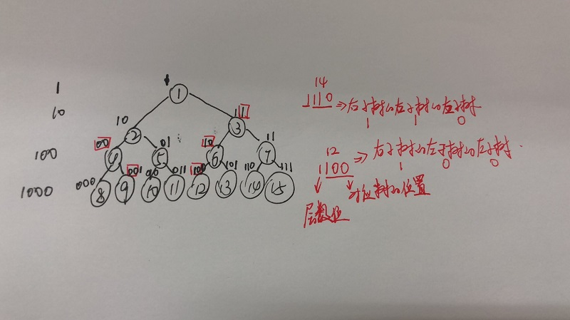
      :book: 学到了，在二分查找中

      ```java
      int mid = (right - left + 1)/2 + left;		// 存在两个中间值时，取中间值的后面一个
      int mid = (right - left)/2 + left;		// 取中间值的前面一个
      ```

63. 题169. [多数元素](https://leetcode-cn.com/problems/majority-element/)<a name = "num169"></a>

    

    题目做出并不难，困难的是有很多方法，都还挺复杂的（没有sort来的简单）

    - 利用sort，先进行排序，由于是众数，即个数>一半的，那么可以判断出排序之后的数组的最中间的值一定是众数了

    - 利用hash表（但是，觉得没有利用到众数的性质）

      将数组中的元素存储到hash表中，然后找其中计数最多的数就是众数

      时间复杂度为O(N)

      空间复杂度为：$n-\lfloor n/2\rfloor$

    - 随机数：这个最坏情况复杂度不可计算，但是可以根据期望来算为O(N)

    - **分治**

      为啥能用分治法呢？

      根据众数，将数组对半分成两半之后，那么**全局的众数也一定是其中一个半份的众数**，这个可以用反证法证明——如果不是任何一部分的众数，那么众数a出现的次数<l/2+r/2，那么就不会是众数，所以前面的结论一定是正确的。同理那个半份中也可以再分，肯定还是更小一部分的众数，所以可以用分治法不断地缩小范围—— 将数组分成左右两部分，分别求出左半部分的众数 `a1` 以及右半部分的众数 `a2`，随后在 `a1` 和 `a2` 中选出正确的众数。 

      如果左右两部分的众数一样，那么就是该部分的众数；如果不一样，需要在整个范围内（左+右范围）遍历看是否是众数

      

    - **Boyer-Moore 投票算法**（以我的智商是不可能会的:weary: ）

      - 维护一个`candidate`数字和他出现的次数`count`，初始count=0
      - 遍历数组，如果count=0，那么当前值就为`candidate`；如果count不为0，那么如果当前值和candidate一样，就++；如果不一样就--
      - 最后，剩下的candidate就是众数
      - 证明看[题解](https://leetcode-cn.com/problems/majority-element/solution/duo-shu-yuan-su-by-leetcode-solution/)
      - 暴力的反证：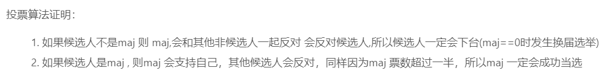

64. 题1370. [上升下降字符串](https://leetcode-cn.com/problems/increasing-decreasing-string/)<a name="num1370"></a>

    

    

    一开始想到对字符串进行排序，然后先正着取后倒着取，但是由于不能顺序取所以边界条件很难控制，很显然不行。后来被提示*它出现的内容限定在了小写英文字母*，所以想到将每个字符出现的顺序放在一个26长度的数组，下标就是对应a~z，而值就是出现的次数——就是限定范围的hash表，所以解法方法就很显然了：

    - 遍历一遍字符串，对每个字符都进行计数统计
    - **在输出的字符串<原始字符串长度的情况下——终止条件：两个字符串相等**（实际卡住的点）
    - 每次都进行顺序遍历26大小数组，再逆序遍历，每次都把值不为0的字符加入一遍

    ——时间复杂度为：O(N)

    :book:`StringBuffer对象`

    new一个对象可以用：`StringBuffer buffer = new StringBuffer();`

    加入字符串/字符可以用：`buffer.append(xxx);`

    判断字符串长度可以用：`buffer.length();`

    将其转换为String类型：`buffer.toString();`

65. 面试02.02. [返回倒数第 k 个节点](https://leetcode-cn.com/problems/kth-node-from-end-of-list-lcci/)<a name="inter0202"></a>

    

    这题没啥好讲的，就是两个快慢指针，快指针先走k步，然后和慢指针一起走，当快指针走到尾时，慢指针和快指针的距离就是k，就是需要的倒数第k个节点

66. offer06. [从尾到头打印链表](https://leetcode-cn.com/problems/cong-wei-dao-tou-da-yin-lian-biao-lcof/)<a name="offer06"></a>

    

    看到这个题第一个想到的是，把他放在数组里面，再将数组reverse一下就可以了，但是需要考虑到：不知道链表长度，所以需要先判断出链表长度——O(N)，然后再创建对应的数组，进行存储——O(N)，可以想到的是：先遍历一遍获得链表长度，创建对应长度的数组；然后再次遍历数组，**从数组最后开始存储**，但是这样的方法不符合题目的原意：从尾到头（本方法没有实现）

    所以有如下两种常见的方法：

    1. 递归求解：先**递**到链表尾部，然后就能逆序**归**到一个队列中——该队列就是逆序存储的，然后将该队列誊到数组中，时间复杂度为O(N)，空间复杂度为O(N)
    2. 辅助栈求解：创建一个栈（本质上就是一个LinkedList对象），将链表按照顺序依次入栈——最早进入的就是链表头——就是栈底，最后进入的就是链表尾——就是栈顶，然后调用`pollLast`从栈顶取出放入数组中，时间复杂度为O(N)，空间复杂度为O(N)

    ——递归稍微有点意思，辅助栈等在这边不能体现其优势

67. 题164. [最大间距](https://leetcode-cn.com/problems/maximum-gap/)<a name="num164"></a>

    

    出息了，开始做难题了。这个题的简单解法其实很暴力，就是调用库函数sort一下，然后遍历就可以，那么时间复杂度为O(NlogN)，就是集中在排序上

    然后看了一下题解，还以为可以不排序直接求解（想想也不可能，时间复杂度只会增不会减），根据提示，可以使用线性的空间复杂度，来达到线性的时间复杂度——那么有什么算法可以在线性时间内完成呢？——基数排序（实际上题解算是：基数排序+计数排序，还有一个桶排序）

    下面来解一下基数排序：

    整体来说，基数排序就是用空间换时间，时间复杂度为O(N)，空间复杂度为O(N)

    它是将整数按照每一位进行排序，从最低位到最高位分别排序，最后得到的也一定是有序的

    - 先找到整个数组的最大值，可以使用`Arrays.stream().max().getAsInt()`——将数组转换成stream，然后调用API找到max，然后再返回int类型——如果忘记/不会，就遍历一次
    - 找到最大值的作用就是知道最大值的位数，要进行几次排序才能能确保数组已经有序
    - 维护一个长度为10的数组——对应0~9位，用来计数——当前位数下，分别出现0~9的次数
    - 开始循环：取出当前位：`(num / exp) % 10`，然后将对应位的数组值++
    - 然后运用计数排序：计算当前位在原数组中应该放置的位置，eg: int[] count = {2, 4, 3, 2, 0, 1, 0, 5, 0, 0}，那么对应的0的数字应该在原数组存放的位置为0~1，1-2~5.....
    - 然后再次遍历数组，将num按照顺序存放到对应的位置——**注意计数排序对应位存放的是该数组下的数字位的最后一位的位置——为了保证排序稳定性（前面已经排好队了，不能将顺序混乱），要从后开始遍历（后面说明前面的数字位上的数字比较大的，所以也应该放在后面）**——具体看代码
    - 重复循环第4~6步，直到max<exp，循环结束，此时数组已经有序了

68. 题15. [三数之和](https://leetcode-cn.com/problems/3sum/)<a name="num15"></a>

    

    这个题是求和这一系列的第一题，也是比较简单的基础题​（:sob:我还是不会做）

    首先，如果用暴力解，用一个三重循环遍历那么时间复杂度在O($N^3$)，然后稍微进行优化，根据题目：找到三元组不能重复

    - 先排序
    - 可以在第二重循环的枚举中找到不小于当前第一重循环的枚举元素
    - 和第三重循环同理，找到不小于第二重循环的枚举元素

    => 那么能想到了排序，但是本质上还是三重循环，那么时间复杂度还是O($N^3$)，继续优化，将下面的两重循环变成一重循环：

    可以发现我们是固定了第一个数然后去找其他两个数的，那么可以将后面两个数看成一个数，那么问题就变成了**在有序数组中从[i, len-1]这个范围内找到一个符合要求的数，那么就变成了双指针问题**，而这个数的值不再是mid，而是两个边界left和right的和。而指针的移动条件就是：如果当前的sum值太大，那么右指针就移动；如果sum太小，那么左指针就移动；如果值正好，那么就是当前值，并且左指针右移，右指针左移（因为是找到所有满足的解）；循环的结束条件就是左右指针相遇

    而双指针情况下，第二三重循环就从O($N^2$)变成O(N)

    ——以上就是整个思考流程（题解里面都没有写如何能想到双指针，我觉得这是一个逐渐推理的过程）

    所以整体思路是

    - 先对数组进行排序
    - 如果第一重循环的i的当前值>0，循环提前结束（因为当前值都>0，后面的值更大了，所以包括当前的都不可能是正解）
    - 如果第一重循环i的当前值 = 前一次循环i的值，跳过该次循环（防止出现重复解，该重复解出现在数组的第0位）,eg: [-1, -1, 0, 1]
    - 如果上面都不满足，那么设置`left=i+1,right=len-1`（一个只能向右，一个只能向左）两个指针，然后开始计算当前值下的解
      - 如果值<0，那么只能修改left，右移——让值更大一点
      - 如果值>0，那么只能修改right，左移——让值更小一点
      - 如果值=0，那么当前值就是一个解，那么left要右移，right要左移，但是移动的位数必须要保证洗一个left和right不能和之前的left和right重复（第二重循环的重复解保证，重复出现在第1、2位）——while循环，找直到left不和前面left+1一样的值；right同理

    - 最后循环结束，将值返回

69. 题18. [四数之和](https://leetcode-cn.com/problems/4sum/)<a name="num18"></a>

    

    这题和前面一题类似，就是在三数之和的基础上再套一层循环，但是需要注意的是，代码不是完全一致：由于target不再是一个>=0的数，有可能是负数——存在的情况是数组中的数都比target大，但是几个负数相加就符合要求——要把遍历提前结束的条件排除掉——剪枝就不需要了（因为我笨:raising_hand: ）

    还需要注意新加一层循环的去重操作

    

    具体代码：

    ```java
    for (int i = 0; i < length - 3; i++) {
        ....
    	if (nums[i] + nums[i + 1] + nums[i + 2] + nums[i + 3] > target) {
            break;		// 当前i下最小的可能都>target——后面就都不可能了
    	}
    	if (nums[i] + nums[length - 3] + nums[length - 2] + nums[length - 1] < target) {
    		continue;			// 当前i下最大的可能都< target——当前i下不可能有解
    	}
    	for (int j = i + 1; j < length - 2; j++) {
    		if (j > i + 1 && nums[j] == nums[j - 1]) {		// 查重
    			continue;
    		}
    		if (nums[i] + nums[j] + nums[j + 1] + nums[j + 2] > target) {
    			break;		// 当前i下，j下，最小都超了——当前的j下是不可能了，所以跳出当前循环
    		}
    		if (nums[i] + nums[j] + nums[length - 2] + nums[length - 1] < target) {
    			continue;			// 当前i下，j下，最大还是不够——(i, j)组合不可能了
    		}
            ...
        }
    }
    
    ```

70. 题454. [四数相加 II](https://leetcode-cn.com/problems/4sum-ii/)<a name="num454"></a>

     

    这个和上面的三数/四数相加不同，不同点在于前面都是在一个数组里面，而数的选择是存在关系的，所以只能遍历+双指针；但是本题，是四个数组中选择数，那么都是独立的（也不需要考虑重复的问题，即使值一样，但是都是从不同数组中选择出来的），所以没有必要遍历，也没法加双指针

    巧妙的解法是：

    A+B遍历之后将解存放到哈希表中

    然后计算C+D，由于目标和是0，那么要符合要求的话就是`A+B=-（C+D）`,那么可以**直接计算出C+D值之后取反，然后直接在哈希表中查找即可**——查找时间复杂度为O(1)

    看评论总结的很好：**看到形如：`A+B....+N=0`的式子，要转换为`(A+...T)=-((T+1)...+N)`再计算，这个T的分割点一般是一半，特殊情况下需要自行判断。定T是解题的关键。 **

    ——看到多个数组中分别取值去计算目标和，可以用分组+哈希表求解

71. offer57.[ 和为s的两个数字](https://leetcode-cn.com/problems/he-wei-sde-liang-ge-shu-zi-lcof/)<a name="offer57"></a>

    

    这个题和上面的[三数](#num15)/[四数](#num18)之和本质上一样，双指针就能解决，并且题目给定的是有序数组（不然可能还需要自己排个序，那么时间复杂度为O(NlogN)），那么双指针下只需要O(N)时间复杂度就可以解决

    [题解给出了正确性证明](leetcode-cn.com/problems/he-wei-sde-liang-ge-shu-zi-lcof/solution/mian-shi-ti-57-he-wei-s-de-liang-ge-shu-zi-shuang-/)

72. offer54. [二叉搜索树的第k大节点](leetcode-cn.com/problems/er-cha-sou-suo-shu-de-di-kda-jie-dian-lcof/)<a name="offer54"></a>

    

    前提是二叉搜索树——二叉搜索树是一个有序的树，它的规律是**根节点的左边全部比根小；根节点的右边全部比根大**——由此得到的一个规律——**二叉搜索树的中序遍历就是从最小值逐渐找到最大值的过程**——这个就是本题的解题关键。

    **如果我们要找第k小的值——那么直接中序遍历，遍历到第k个节点的时候返回即可；**

    **那么第k大的值也一样——中序遍历，但是从“左根右”切换到“右根左”，那么该中序遍历就是从最大值逐渐找到最小值的过程——遍历到第k个节点，那么就是第k大的数**

    在本题中，思路理出来之后，还需要考虑实现，我们需要维护一个全局变量target，存放需要的结果（方便递归的时候寻找需要的解），并且考虑到找到解时（就是k==0），需要直接返回而不继续遍历下去

73. 题976. [三角形的最大周长](https://leetcode-cn.com/problems/largest-perimeter-triangle/)<a name = "num976"></a>

    

    能想到要排序，但是没想到贪心，啊啊啊啊啊就差一点点:sob:

    问题所在就是，我写的是升序排序，但是为了求最大值很明显应该是降序排序啊:sob:（主要是被之前的三数之和的遍历限制了思维，没有发现两题是完全不一样的）

    当你降序遍历之后，你就会发现**为了让周长最大，肯定是找最大的三个数构成三角形，就看最大的三个数能不能构成三角形（a<b+c）,如果不行的话，那么后面的值就更加不可能了(a > b+c, 而b>d,那么a>c+d)，所以查找下一组最大值**——就是类似于固定最大的数，看后面两个数是否满足三角形形成；如果行就已经是max了；如果不行，那么最大数变小一点（数组里面平移），然后去查找下一个看是否满足

74. 题589. [N叉树的前序遍历](https://leetcode-cn.com/problems/n-ary-tree-preorder-traversal/)<a name="num589"></a>

    

    这题很简单，可以用递归和迭代两种方式做

    递归的话，就是常规的中、左、右，然后将左右改成for循环遍历

    迭代的话，就是显式的构建一个栈，然后从**右向左**将孩子节点插入到栈中，迭代的结束条件是栈为空

75. 题114. [二叉树展开为链表](https://leetcode-cn.com/problems/flatten-binary-tree-to-linked-list/)<a name = "num114"></a>

    

    根据这个展开，能看到就是二叉树的前序遍历，然后需要维护一个全局节点`prev`，是用来存放上一个遍历到的非null的节点，就是当前节点的前驱节点；且由于是前序遍历，那么当前节点会在遍历left、right之前就修改掉root的left和right，那么需要两个节点提前保存一下 

    （这个题目挺简单的，但是困+带耳机，硬生生的写了好几遍才写对，刷题的时候不要听歌！！！）

    更多的解法：

76. Offer09. [用两个栈实现队列](https://leetcode-cn.com/problems/yong-liang-ge-zhan-shi-xian-dui-lie-lcof/)<a name="offer09"></a>

    

    本题的困难之处在于，读懂题目:joy:，题目看起来很复杂，结合代码框架就会容易很多

    题目的意思就是第一行的数组就是对应的操作：`CQueue`就是初始化队列；`deleteHead`就是调用需要的出队操作；`appendTail`就是调用需要的入队操作，然后下面一行数组就是在操作过程中对应的参数；可以发现，只有在调用`appendTail`才会有参数，其余均为空

    ```java
    class CQueue {
    
        public CQueue() {		// 构造方法
        }
        
        public void appendTail(int value) {		// 入队操作实现
        }
        
        public int deleteHead() {			// 出队操作实现
        }
    }
    ```

    比较栈和队列，我们可以发现栈就是栈顶入栈顶出，最早进入的在栈底；而队列是队尾入，队头出，最早进入的就是在队头，马上就能出去；所以如果要出栈底的话，**需要一个辅助栈将原栈全部出栈后，入辅助栈，那么辅助栈里面就是正常的队列顺序了**——每次出队操作就从辅助栈里面出，入队就从原栈入。

    所以——入队操作很简单；

    出队操作——我实现的是，每次都将`in`（存放输入的栈）全部都移入`out`（存放即将输出的），此时逆序，然后从out中去栈顶；然后将out全部又出栈入in栈——这个操作是不必要的

    优化之后：每次取都从out取；**如果此时out栈为空，才将in栈全部压入out栈**，再取；如果in和out均为空，那么说明队列为空，返回-1——减少不必要的操作

77. Offer36. 二叉搜索树和循环双向链表<a name="offer36"></a>

    

    

    就是将一棵二叉搜索树转换为双向链表，很明显需要用到的二叉树遍历为中序遍历，需要维护一个prev节点，用来保存紧邻的前一个遍历节点，以满足相互指向。此外还需要维护一个节点head，用来指向链表头，作为最后结果的返回值，也能在遍历结束后将链表首尾的节点连接起来。

    我的做法是：head是额外加的一个dummy指针，每次的root的right都需要指向head；head的left指向root——每次root更新都更新一次，直到递归结束。当递归结束之后，最后的节点的right也是指向了head，而head的left指向了尾节点，然后将head排除即可——2个指令可以完成（具体看代码）

    聪明的做法是：head只需要在第一次prev为null的时候，更新head=root，此时的root就是根；而当递归结束，那么此时的prev就是尾结点，只需要将prev和head互相指向即可(:joy:这个人真的太聪明了，我是垃圾:raising_hand:)

78. Offer03. [数组中重复的数字](https://leetcode-cn.com/problems/shu-zu-zhong-zhong-fu-de-shu-zi-lcof/)<a name="offer03"></a>

    

    这题AC并不难，难的是如何想到最优解

    通俗解法：

    1. 时间复杂度高：将数组sort一下，然后从前向后搜，前一个结点和后一个节点值一样，那就是重复的节点

       时间复杂度为O(NlogN)，无额外空间

    2. 拿空间换时间，将遍历到的数字都存放在hash表中，如果遍历到了之前出现过的，那么就是重复数字

       时间复杂度为O(N)，空间复杂度为O(N)（因为限制了数字的大小在0~n-1范围内）

       ——但是这个时间复杂度和空间复杂度都好惨的样子

    天才解法：（爷跪了:cow: :beer: ）

    我们先来考虑什么时候没有重复数字，就是在N长度的数组中，每个数组的值都是唯一的，因为题目限制了数字大小集中在0~n-1范围内，所以的整个数组中0~n-1的数字有且仅有1个，那么我们能**快速给他们排序——根据当前的值找到其索引（7-7）交换位置即可，那么当前值就是有序的了**，依次类推时间复杂度为O(N)

    那么如果重复，那么就是在排序过程中，同一个索引位置已经有序了，但是还想要再塞一个——那么这个就是出现了重复

    ——本质上用到了**“一个萝卜一个坑”**的解法（只有限制了数据的范围才能使用）
    
79. 题202. [快乐数](https://leetcode-cn.com/problems/happy-number/)<a name="num202"></a>

    

    哎:disappointed:，今天就没有成功AC题，可能是因为之前碰到的题都太简单了，自己也太着急了点，还是要一步一个脚印的去做题，别想着马上就能得到很大的提高。（ps：实验室就不是一个学习的好地方:dog: 适合讨论，不适合学习，和师兄讨论一下还是收获很大的，赶紧要拿个小本本记下来:pen: :book:）zcc，你可以的！

    言归正传：

    这个题找快乐数（做了这个题爷的快乐就飞了）

    就是每次将一个数字的位数分别进行平方之后相加，看最后能不能变成1——快乐数；不能——不是。

    会想到：会不会这个数的值超范围？如果不能会出现什么情况？

    - 超范围问题，我们可以想一下

      

      所以随着无限执行下去，不会出现无穷大的情况

    - 那么无法到达1，那么就出现了一个循环——可能不断在多个数之间来回转换（注意是多个数的循环——而不是前后相等）

      

      ——所以本题的**关键点就是找到该循环**，证明无法减少到1——非快乐数

      ——**循环的问题，可以用快慢指针来解决**，slow指针每次走一步；fast指针每次走两步，如果存在循环一定能相遇——妙啊！

      时空复杂度：

      

      当然也能用一个hashset存储出现过的数字——如果重复出现就说明存在环

      时空复杂度：

      

      

      

80. 题215. [数组中的第K个最大元素](https://leetcode-cn.com/problems/kth-largest-element-in-an-array/)<a name="num215"></a>

    

    这个是面试的超高频题目，必须要掌握的

    主流有三种解法：暴力、**基于快排的partition**、**基于最大/最小堆的原理实现**，显然后两个是重点。[题解需要好好分析](https://leetcode-cn.com/problems/kth-largest-element-in-an-array/solution/partitionfen-er-zhi-zhi-you-xian-dui-lie-java-dai-/)

    1. 暴力

       sort就完事了，由于sort是升序排列，所以需要先找出top-k所在的索引值——这点就很容易错——**len-k**就是对应升序的索引位置

       时间复杂度为O(NlogN)——主要时间都花在sort上了，很显然这个还能优化

    2. 减而治之

       根据快速排序的原理进行实现

       首先来复习（预习）一遍快排

       

    3. 

81. Offer 56-I. [数组中数字出现的次数](https://leetcode-cn.com/problems/shu-zu-zhong-shu-zi-chu-xian-de-ci-shu-lcof/)<a name="Offer56-1"></a>

    

    这个和之前做的[一题](#num136)很类似，那个题限定的是其他数字都出现了2次，而只有一个数字出现了一次，令人印象深刻的就是用了**异或**的特性来一次遍历求解——异或

    异或的特性如下：（需要注意的是1、2）

    

    本题还是要用到异或那么在本题里面一次异或之后得到的值就是两个唯一一次出现的数字的异或值>0——不能直接从异或得到值了，但是观察发现因为两个数字不一样，那么**他们的位上至少存在一位是0/1不同的**，那么我们从异或结果开始找到第一位非0的值——这个就是掩码，然后我们再次遍历数组，将数字依次与掩码做比较，由于其他数字都出现两次，那么一定存在部分数字（2份形式出现）与掩码&一下为0——分为组1；一定存在部分数字（2份形式出现）与掩码&一下为1——分为组2；且根据该掩码能够将目标数字a/b划分在两个组里，那么最后在不同组内的异或操作结果就是两个值了

    ——核心思路，既然有两个单次出现的数，那么**将这两个数字分在两个不同的组里面进行异或操作就能得到了**。分组就根据两个数的0/1位不同找就可以了，而因为其他数出现两次，所以被分到组里的一定有2个相同的数

    题解真的是妙到家了:paw_prints:

82. 题204. [计数质数](https://leetcode-cn.com/problems/count-primes/)<a name="num204"></a>

    

    就是找到<n的所有质数，首先想到的是，遍历从2~n的所有数，并且调用`isPrime`函数去判断是否是质数，而`isPrime(m)`是找从`2~sqrt(m)`的所有数，所以时间复杂度为$O(n\sqrt n)$——很明显，想当然的解就是不可能是最优解——果然，运行超时了
    
    学到了一个新算法：**埃氏算法**
    
    可以想到，2的倍数都是非质数（$2*i（i>1）$），因为能被2整除；那么3的倍数都是非质数（$3*i(i>1)$），因为能被3整除；同理，5、7.....，可以发现质数的倍数都是非质数，且能包含所有的非质数
    
    那么可以先将2~n的数标记为true——表示为质数，然后找到所有2的倍数标记为——非质数，依次类推。注意遍历的上界，只需要找**2~sqrt(n)**，因为$(sqrt(n), n)$之后的数字都会通过前面的数查找一遍，后面的数相互也不可能称为倍数；然后在找倍数的时候可以从$[i*i, n)$范围找，因为i*i（表达为：质数 * 倍数）前面的非质数数一定被之前的质数的倍数找过了，所以不可能存在漏解
    
    时间复杂度：O(NlogNlogN)；空间复杂度为O(N)
    
83. 题225. [用队列实现栈](https://leetcode-cn.com/problems/implement-stack-using-queues/)<a name="num225"></a>

    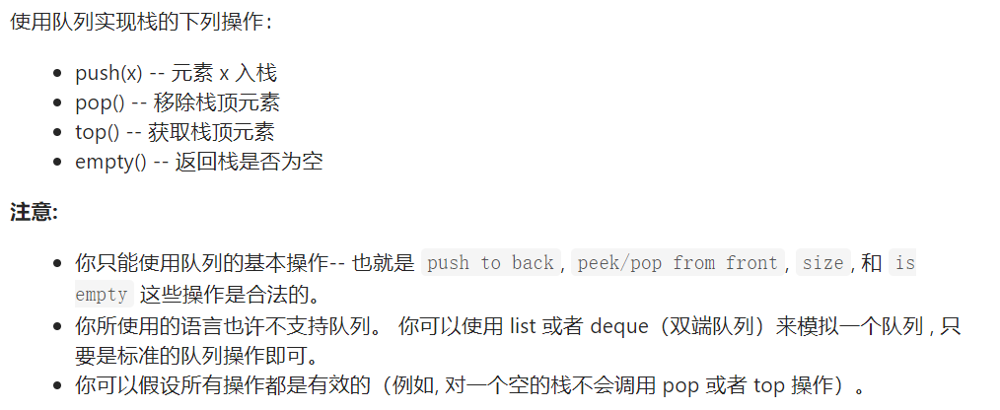

    由于受[用两个栈实现队列](#offer09)的影响，想当然要用两个队列实现栈——麻烦很多，但是至少实现了，但是操作很频繁并没有优化，可以对其进行优化，可以看[题解](https://leetcode-cn.com/problems/implement-stack-using-queues/solution/yong-dui-lie-shi-xian-zhan-by-leetcode-solution/)——就是说大家一起用笨蛋方法，它还比我聪明很多:sob:

    

84. 题118. [杨辉三角](https://leetcode-cn.com/problems/pascals-triangle/)<a name="num118"></a>

    

    这个题是一道很简单很简单的题，刚学C语言的时候就应该会的题——但是自己从来没有手动实现过（该吃的:shit:迟早都要吃），但是发现并不能在5分钟之内解出来
    
    那就好好分析一下吧：每一行长度都是其索引+1；普通的点：左上方数+右上方数——即前一个数组[cur_index-1]+前一个数组[cur_index]，麻烦的是处理边界情况：第一行，索引为0，只有一个元素[1]；其余行首尾需要特判为1，即cur_arr[0] = 1;cur_arr[i]=1;
    
    那么代码就已经出来了，还有输出的结果是一个二维数组，每次求出一行就需要将当前数组加入到二维数组中（数组索引从0开始）
    
    时间复杂度为$O(N^2)$
    
    还有一个小规律：
    
    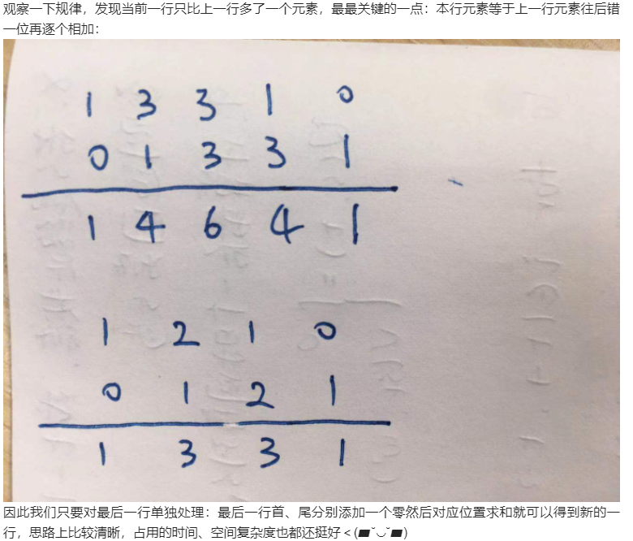
    
    ——在前面一个数组后面补0，然后错位相加就是当前行的值（python实现很方便，但是Java感觉没必要）
    
85. 题191. [位1的个数](https://leetcode-cn.com/problems/number-of-1-bits/)<a name="num191"></a>

    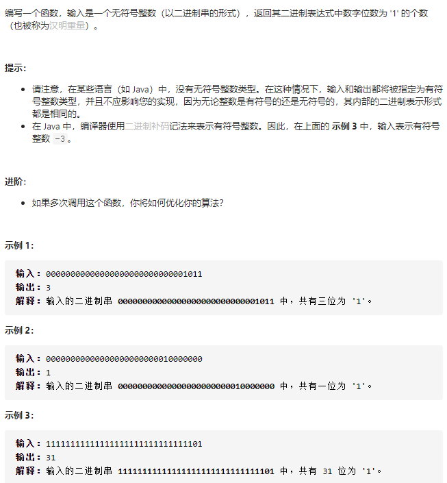

    关于位操作的题。有两种解法

    1. 利用掩码的知识，和题[Offer 56-I. 数组中数字出现的次数](#Offer56-1)其中一个点很像（那题更难一点），掩码就是大部分位数都是0，只有特定的位是1，然后**进行相与，从而求出对应1的位置**

       这边就是从最小的掩码1，开始不断相与，如果结果!=0，那么对应位存在1；如果==0，那么对应位就是0。掩码值不断变大，用左移位操作<<1，1->2->4->8->....

    2. 更骚的操作：可以发现**n&(n-1)就会将最低位的1变成0**

       - 如果n-1为偶数，那么n为奇数：显然n-1为偶数，则最后一位为0；所以奇数就是将最后一位变成1；那么n&(n-1)，最后一位1&0=0——所以n的最低位1变成了0
       - 如果n-1为奇数，那么n为偶数：n-1到n肯定是发生了进位，将最后连续的1全部变成0，然后将最低位的0变成1，如果n-1的最后几位是0111，那么进位之后n变成了1000。所以n&(n-1)也会将最低位的1变成0

       然后利用该原理，不断将n与n-1相与，然后保存当前的结果到n，直到n==0（不能写n<=0，因为输入是无符号整数，但是对于Java来说都是当作有符号数来处理的，所以会直接将最高位为1的输入当作负数而不处理），记录相与的次数——这个就是1的个数

       

       ——学到了**n&(n-1)就会将最低位的1变成0**

       时间复杂度，由于限定是32位，那么时空复杂度为O(1)

86. 题190. [颠倒二进制位](https://leetcode-cn.com/problems/reverse-bits/)<a name="num190"></a>

    

    这个题是个很简单的题，如果有上面[第七题](#num7)的基础，第七题是整数颠倒，而本题是二进制颠倒。这题的麻烦点在于——该二进制表示的是无符号数，而Java中均是有符号数。所以要将符号的影响消除

    1. 方法一：类似于整数颠倒

       就是从最低位开始，不断取出，然后新数向左移1位，然后+取出的数，如此循环就得到了逆序

    2. 我的解法：

       将对称的两个位通过mask取出(`1 << i`,`1 << (31 - i)`)，然后分别移动到对称位（`left >> (31-i-i)`, `right << (31-i-i)`），然后与输出值做异或操作——0与任何值做异或操作都是其本身

       但是存在负数的问题（之前正数都是正确的，说明整个逻辑方面没有问题，那么肯定是负数存在没有考虑到的问题），问题出在：`left >> (31-i-i)`，如果最高位是1，表示负数，那么在**移位的时候默认全部补1**，所以变成了1.....1(32个1)，然后初始一做异或，返回值直接变成了全1值

       所以这个操作下，需要对特殊处理最高位和最低位：如果最高位值为1（负数），那么手动将返回值的最低位置1；而最低位的颠倒没差

    3. 

    

    ——**如果遇到整数逆序/二进制逆序时，即得要用低位取数（用>>或%），然后加入res，并res乘（<<或*10），那么本来的低位最后变成了高位，最后就成了逆序**

87. 题231. [2的幂](https://leetcode-cn.com/problems/power-of-two/)<a name="num231"></a>

    

    如果最普通的实现就是：n不断去除以2，直到无法整除就结束循环，判断结束循环的时候是否已经遍历到1——如果已经到1，说明是从...2->1-> 跳出循环的；如果$\neq1$，那么是从奇数得到的，那么一定存在多个1（对于二进制）——时间复杂度为O(NlogN)

    更简单的：根据[题191](#num191)可以知道——n&(n-1)可以消去n的最后一位1，如果n为2的幂，那么该操作结束之后值为0，如果不是，那么就不是——时间复杂度O(1)

88. 题762. [二进制表示中质数个计算置位](https://leetcode-cn.com/problems/prime-number-of-set-bits-in-binary-representation/)<a name="num762"></a>

    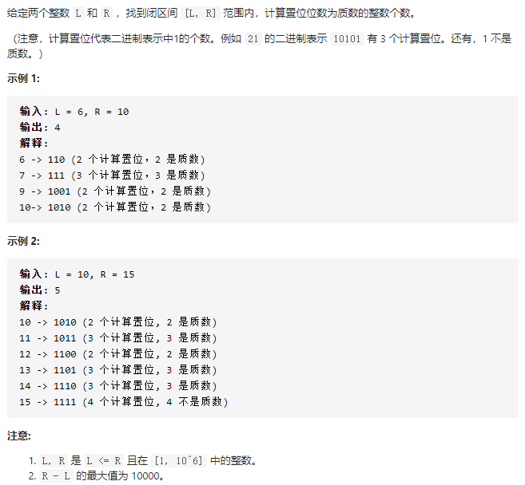

    本题实在是简单，唯一一点，需要判断该1的个数是否是一个质数，根据题目给的限制条件$[1, 10 ^6]$，那么我们可以发现该数的位数最多为19位，哪怕全为1，也是19，所以可以直接把1~19的质数全部列出，查表即可。

    求某数的1的个数可以直接调用**Integer.bitCount(n)**计算即可（比我们自己实现的不断取余除法效率高）

89. 题338. [比特位计数](https://leetcode-cn.com/problems/counting-bits/)<a name="num338"></a>

    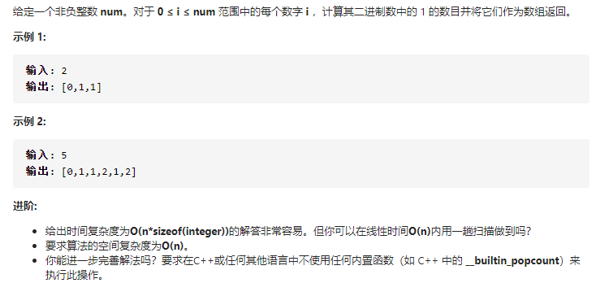

    一开始的想法很朴素，就是发现奇数和偶数应该要分开考虑，进而发现奇数是前面一个偶数bit个数+1；而偶数通过找规律和移位逻辑发现，是和其/2个数一样的

    - 奇数，就是最后一位为1，而偶数最后一位为0，那么奇数肯定比前面紧邻的偶数多一位1，即res[i] = res[i - 1]+1
    - 偶数，是任意数`*2`，均能得到偶数，而`* 2`就是一个左移操作，本质上没有改变1的个数（只是在最后面补0），那么偶数的1的个数 = 其/2数的， 即res[i] = res[i>>1] 这样就能包含所有范围的数（注意0需要单独考虑）

    那么代码就已经可以实现了

    看了之后，发现其实其本质就是动态规划，状态转移方程如下： `P(x) = P(x / 2) + (x mod 2)`

90. 题861. [翻转矩阵后的得分](https://leetcode-cn.com/problems/score-after-flipping-matrix/)<a name="num861"></a>

    
    
    翻转操作可以是行翻转、列翻转两种
    
    目标是要求有最高的分数，而每一行中的每个元素的权重是不一样的，可以发现，**优先要保证每行首元素为1**——因为后面的数哪怕全为1，和都比首元素至少要小1，eg: 8、4、2、1，所以行翻转的操作就是保证第一列全为1。这之后行不能再翻转——因为会改变行首元素的值。
    
    然后列翻转，第一列已经全为1，那么后面的列，每一列中权重都一样，我们要**保证1的值比0多**（如果不是就翻转）。
    
    在实现中，并不需要操作数组，而是遍历每一列计算1的个数，`Math.max(count_1, row - count_1)`就是每一列1的最大可能，乘上其权重就是当前位的最大值；而第一列都是1，所以就直接`row *(1<<(col-1))`
    
    总结：看到这种题，看到贪心就害怕了，所以没有认真分析，没有找对切入点，还是要好好思考（因为在纸上推算的时候，已经发现要保证最高位为1的操作了，就是列操作没有找对）。感觉贪心的题看了题解就没有意思了，要努力的找到正确的切入点
    
91. 题216. [组合总和 III](https://leetcode-cn.com/problems/combination-sum-iii/)<a name="num216"></a>

    
    
    求组合的题，一般需要用到回溯——类似于枚举，遍历所有的可能，记录满足条件的值
    
    具体看：[常见算法及实现整理](https://github.com/amyZhoucc/algorithm/blob/master/%E5%B8%B8%E8%A7%81%E7%AE%97%E6%B3%95%E5%8F%8A%E5%AE%9E%E7%8E%B0%E6%95%B4%E7%90%86.md#%E5%9B%9B%E5%9B%9E%E6%BA%AF)
    
    套路是：
    
    1. 画出递归树，帮助分析
    2. 使用dfs，搜索所有可能的情况
    3. 注意**状态重置**和剪枝（非必要，如果不是很熟练可以暂时不研究）——需要针对不同的题，进行特殊情况分析在，找到提前终止遍历的条件
    
    **在写`backtrack`函数的时候，发现其参数列表很长，如果不是看了答案不可能一下子想全的——所以是边写边补充需要传的参，缺啥补啥**
    
    这个题可以剪枝，但是效果不好
    
    - 针对输入：`n <= 0 || k <= 0 || n < k`——可以直接返回；并且可以求极大值`{9, 8,....(9 - k + 1)}`，n不能超过这个最大值（否则无解）,所以是`(19-k)*k/2 <n`——可以直接返回
    - 针对回溯过程：`if(10 - start < k - list.size()) return;`——剩余数的个数小于需要的个数，那么肯定无法构成组合了
    
    ps：补充一个知识：新建一个数组将原来的数组存放过去：`new ArrayList<>(list)`=>就能将数组拷贝过去了（浅拷贝，数组的地址是独立的，因为里面的元素是基本数据类型，所以是值传递，所以是复制；如果里面的元素是引用数据类型，那么就是复制该数据的地址）
    
92. 题39. [组合总和](https://leetcode-cn.com/problems/combination-sum/)<a name="num39"></a>

    

    和上一题类似都是组合问题，都是用到了回溯。这一题是在指定的数组里面找到所有满足要求的组合（整个类似），本题没有限制组合的长度，并且数字可以重复使用，但是组合不能重复

    数字可以重复，组合不能重复——解题关键，我们可以看到前面一题为了防止重复是从`i+1`开始遍历的，那么如果我们递归是从`i+1`开始遍历，那么数字无法重复；如果都从0开始遍历，那么后面的组合可能会和前面的组合重复

    可以看到，我们在纸上模拟的时候，都是从第一个元素开始，固定下当前数字，然后遍历；然后针对第一个元素所有情况都找完后，固定第二个元素（此时第一个元素不会再出现），那么我们可以推出——**从i开始遍历**（保证数字有重复，但是组合不会重复）

    其余操作和上面几乎类似

    剪枝操作：

    - 对数组进行排序
    - 在dfs时，如果加上当前值已经超过target，那么没有继续要做的必要——因为后面的数字更大，更会超

    ——能减少递归的次数，加快执行效率

93. 

    


## 到底啦

