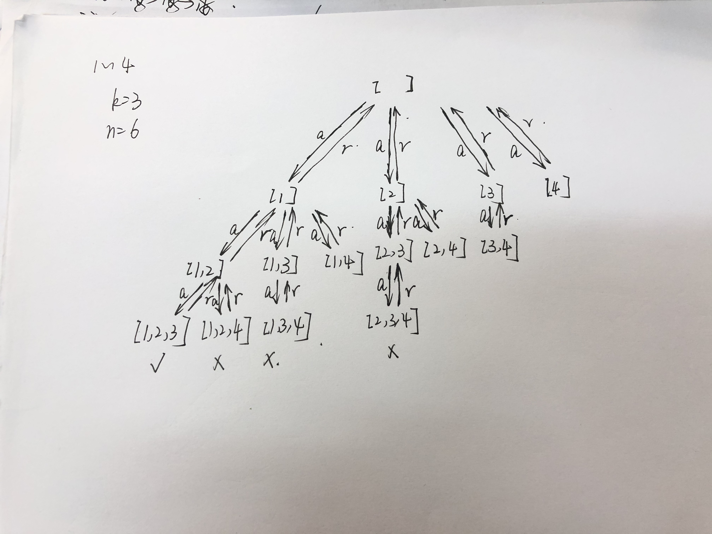

# 常见算法及实现整理

## 一、查找

查找的方法有很多种：二分查找

### 1. 二分查找——一定针对有序数组

#### （1）基础问题

描述：对一个**有序数组**进行查找，如果找到目标数，就返回该目标数的索引。找不到就返回-1

代码实现：

```java
/* 二分查找函数 */
public static int binarySearch(int[] nums, int target){
    int left = 0;
    int right = nums.length - 1;
    int mid;	// 设置三个指针，代表首、尾、中
    while(left <= right)		// 循环边界条件（可能会有变种）
    {
        // 如下操作，而不是，(left+right)/2，是为了防止两数太大而上溢
        mid = ((right - left) >> 1) + left;
        if(target == nums[mid]) {
            return mid;		// 如果最中间的数就是解，那么就直接返回
        }
        else if(target < nums[mid]){			// 如果目标数较小，那么尾指针向下收缩
            right = mid - 1;		// 可能会出现变种
        }
        else if(target > nums[mid]){		// 如果目标数较大，那么首指针向上收缩
            left = mid + 1;		// 可能会出现变种
        }
    }
    return -1;			// 直到循环结束也没有找到目标，那么直接返回-1
}
```

:alarm_clock: 核心点解释：

- 算法的搜索区间是`[left, right]`（双闭区间）
- 算法停止时刻：mid指向了target，那么就立即停止；一直没有找到，就需要while循环终止——**搜索区间为空的时候就应该停止了**，所以该算法停止时刻：`left = right + 1`(left = right不会停止)，即该区间内元素个数为0（`[right+1, right]`）
- 算法更新：当mid没有指向target时，就需要更新`left or right`，根据判断可以缩小范围：如果`num[mid]> target`，那么就要缩小上限，所以区间变成了`[left, mid - 1]`（因为mid已经比过了，所以跳过）；如果`num[mid]<target`，那么就要缩小下限，所以区间变成了`[mid + 1, right]`（mid比过了，跳过）

ps: 如果需要将循环的边界条件修改为`while(left < right)`，那么循环的终止条件为`left == right`，那么该区间内还有一个元素（`[left, left]`），那么就在返回之前需要再进行判断：`return num[left] == target ? left: -1;`

:disappointed: 算法局限性

对于数组里找元素是可以的，但是如果数组中有多个同样元素，并且需要获得其左侧or右侧边界，那就需要改进算法。eg：[1, 2, 2, 2, 3]，target=2，那么左侧边界为1，右侧边界为3。如果是3，那么左右侧边界均为4。

下面就是对算法的改进

#### （2）提升问题1

描述：一个有序数组，数组中元素可能存在重复，现给定一个target元素，请获得其左侧边界

```java
public static int leftboundSearch(int[] nums, int target){
    if(nums.length == 0) return -1;
    int left = 0;
    int right = num.length;		// 区别1
    int mid;
    while(left < right){		// 区别2
        mid = ((right - left) >> 1) + left;
        if(target == nums[mid]) {
            right = mid;		// 区别3
        }
        else if(target < nums[mid]){
            right = mid;		// 区别4
        }
        else if(target > nums[mid]){
            left = mid + 1;
        }
    }
    // 其实，while循环结束，我们也可以获得<target的元素个数（也是一种应用场景）
    // eg：[2,3,4,5],target=1,得到的left=0(right同值)——表示小于0的元素有0个
    // eg:[1,2,2,2,4,5],target=2,得到的left=1——表示小于2的元素有1个
    if(left == nums.length) return -1;		// 防止target太大，而上溢
    return nums[left] == target ? left: -1;	// 确认指向的是否时正解or被迫循环终止的点
}
```

:alarm_clock: 核心点解释：

- 算法的搜索区间：`[left, right)`，左闭右开。（可以改成双闭区间，但是常见的左右侧边界的二分查找实现均是左闭右开，所以就按照这个思路来）
- 算法停止时刻：`left == right`，并且由于搜索区间是左闭右开的，所以[left, left)，区间为空，那么就不会存在漏搜索
- 算法更新：对于right的更新都是`right= mid`，而left都是`left = mid + 1`，这是由于搜索区间是左闭右开的原因。当检测`nums[mid]`被检测之后，下一步的搜索区间就被划分成两个：`[left, mid)`，`[mid+1,right)`
- 算法的有效性：为啥通过这个能获得左侧边界呢？——`if(target == nums[mid]) right = mid;`即在找到目标之后，不会立即返回，而是不断缩小right的范围，在[left, mid)范围内查找，从而锁定了左侧边界。而对于没找到时，也会不断缩小上下界，直到程序停止。

ps：可以将该算法统一成第一个问题的样式，方便记忆，即双闭区间

```java
public static int UNIONleftboundSearch(int[] nums, int target){
    int left = 0;
    int right = num.length - 1;	
    int mid;
    while(left <= right){		
        mid = ((right - left) >> 1) + left;
        if(target == nums[mid]) {
            right = mid - 1;		
        }
        else if(target < nums[mid]){
            right = mid - 1;		
        }
        else if(target > nums[mid]){
            left = mid + 1;
        }
    }
    if(left == nums.length) return -1;		// 防止target太大，而上溢
    return nums[left] == target ? left: -1;	// 确认指向的是否时正解or被迫循环终止的点
}
```

#### （3）提升问题2

同题（2），现在寻找右侧边界

```java
public static int rightboundSearch(int[] nums, int target){
    if(nums.length == 0) return -1;
    int left = 0;
    int right = nums.length;
    int mid;
    while(left < right){
        mid = ((right - left) >> 1) + left;
        if(target == nums[mid]){
            left = mid + 1;			// 区别1
        }
        else if(target < nums[mid]){
            right = mid;
        }
        else if(target > nums[mid]){
            left = mid + 1;
        }
    }
    if(left == 0) return -1;		// 防止target太小，而left一直为0
    return nums[left - 1] == target ? left - 1: -1;		// 确认指向的是否时正解or被迫循环终止的点
}
```

:alarm_clock: 核心点解释：

- 算法搜索区间：同样是左闭右开`[left, right)`
- 算法停止时刻：同上
- 算法更新：同上
- 算法有效性：为啥能够通过该算法得到右侧边界呢？——`if(target == nums[mid]) left = mid + 1;`，找到目标后，不会直接return，而是不断缩小left范围，即在[mid+1, right)的范围内查找，从而找到了右侧边界；而对于没找到目标，也会不断缩小范围，直到程序停止。
- 最后的返回值是`left - 1`，由于算法更新时，划分新的区间一定是`[left, mid),[mid + 1， right)`，所以`left = mid + 1`，所以即使left找到了正解，也会被迫向后移动一位，所以都需要 -1

ps：可以将该算法统一成第一个问题的样式，方便记忆，即双闭区间

```java
public static int rightboundSearch(int[] nums, int target){
    int left = 0;
    int right = nums.length - 1;
    int mid;
    while(left <= right){
        mid = ((right - left) >> 1) + left;
        if(target == nums[mid]){
            left = mid + 1;	
        }
        else if(target < nums[mid]){
            right = mid - 1;
        }
        else if(target > nums[mid]){
            left = mid + 1;
        }
    }
    if(left == 0) return -1;		// 防止target太小，而left一直为0
    return nums[left - 1] == target ? left - 1: -1;		// 确认指向的是否时正解or被迫循环终止的点
}
```

对其总结： [leetcode上有人将其总结的很好 ](https://leetcode-cn.com/problems/search-insert-position/solution/te-bie-hao-yong-de-er-fen-cha-fa-fa-mo-ban-python-/)，[github上也有总结]( [https://github.com/labuladong/fucking-algorithm/blob/master/%E7%AE%97%E6%B3%95%E6%80%9D%E7%BB%B4%E7%B3%BB%E5%88%97/%E4%BA%8C%E5%88%86%E6%9F%A5%E6%89%BE%E8%AF%A6%E8%A7%A3.md](https://github.com/labuladong/fucking-algorithm/blob/master/算法思维系列/二分查找详解.md) )

​                                                             									**二分查找典型题（Leetcode）**

| 题号                                                         | 问题描述                                                     |
| ------------------------------------------------------------ | ------------------------------------------------------------ |
| [题35. 搜索插入位置](https://leetcode-cn.com/problems/search-insert-position/) | （简单）可用二分查找做，稍微修改即可，关注**只有大于目标值的才可能称为索引** |
| [题704. 二分查找](https://leetcode-cn.com/problems/binary-search/) | （简单）典型的二分查找，不需要修改，直接套模板即可           |
| [题34. 在排序数组中查找元素的第一个和最后一个位置](https://leetcode-cn.com/problems/find-first-and-last-position-of-element-in-sorted-array/) | （中等）典型的二分查找边界问题，不需要修改，直接套模板即可   |
| [题69. x 的平方根](https://leetcode-cn.com/problems/sqrtx/)  | （中等）可以使用二分查找，稍微修改，通过纸上模拟明确边界条件，注意大值溢出问题 |
| [题441. 排列硬币](https://leetcode-cn.com/problems/arranging-coins/) | （简单）可以使用二分查找（不是最优方法），注意大值溢出问题   |
| [offer 53-1. 在排序数组中查找数字I](https://leetcode-cn.com/problems/zai-pai-xu-shu-zu-zhong-cha-zhao-shu-zi-lcof/) | （中等）同题34                                               |


## 二、排序

### 1. 快速排序⭐

很常见，Java的底层排序基础就是快排（可能还加上了很多其他的机制以加快排序，但是基础思想就是这个），时间复杂度就是**O(NlogN)**（后面分析），当本身是一个有序数组将其逆序的话，时间复杂度会退化到O(N^2)

（一开始在学的时候，没有完全认识到快排的巧妙之处，直到做到了[TOP-K问题—215. 数组中的第K个最大元素](https://leetcode-cn.com/problems/kth-largest-element-in-an-array/)，原来快排蕴含的思想才是最宝贵的）

下面将重点分析思想，并做实现和一定的情况分析和改进

#### (1) 快排的思想

基本思想：

#### (2) 快排的实现


#### (3) 快排的应用


## 三、二叉树（n叉树）

#### 1. 二叉树的遍历问题

二叉树的遍历是对二叉树进行操作的基础步骤，一般复杂的题目都是在遍历的基础上进行的。而解题的关键是，选择何种遍历策略，如何修改遍历模板

二叉树的遍历有两种方法：深度优先 DFS，广度优先 BFS。

DFS 利用的是**递归**的思路，不断的向下挖掘，直到遇到叶子节点的孩子节点（为 null 节点），才开始返回，具体看代码实现。

DFS 的优势是：代码简单；

DFS 的时间复杂度 O(n)；空间复杂度 O(height)——堆栈的深度决定，而堆栈的深度取决于二叉树的深度

代码实现：

```java
/* TreeNode类，是树节点的属性和函数 */
public class TreeNode {
	int val;		// 节点的值
	TreeNode left;	// 左孩子节点
	TreeNode right;	// 右孩子节点
	TreeNode(int x) { val = x; }
 }

public void DFS_tree(TreeNode root){
    if(root == null) return;	// 递归的结束条件，从这步开始回调
    DFS_tree(root.left);	// 递归遍历左子树
    DFS_tree(root.right);	// 递归遍历右子树
}
```

BFS 利用的是迭代的思想，维护一个队列，从根节点开始，先遍历同一层的节点（从队头出），并且在遍历的时候，不断将其子节点压入队列中（队尾入），不断向下遍历，直到某一层不存在任何节点，那么程序迭代结束。

代码实现：可以在此基础上，进行遍历输出、求树的深度等操作

```java
/* TreeNode类，是树节点的属性和函数 */
public class TreeNode {
	int val;		// 节点的值
	TreeNode left;	// 左孩子节点
	TreeNode right;	// 右孩子节点
	TreeNode(int x) { val = x; }
 }

public void levelOrder(TreeNode root){
    if(root == null) return null;		// 处理特殊情况
    LinkedList<TreeNode> queue = new LinkedList<TreeNode>();		// 存放当前层级的节点
    queue.offer(root);		// 将根节点压入栈
    int depth = 0;			// 记录树的深度
    while(!queue.isEmpty()){		// 开始迭代——当前层存在需要遍历的节点
        int size = queue.size();
        while(size > 0){		// 遍历当前层的所有节点
            TreeNode current = queue.poll();		// 取出队首元素
            if(current.left != null) queue.offer(current.left);	// 将当前节点的左右孩子节点均加入到队尾
            if(current.right != null) queue.offer(current.right);
            size--;
        }
        depth++;
    }
}
```

#### 2. 二叉搜索树

二叉搜索树，就是一棵有序的二叉树，具体的顺序体现在，每个根节点的左子树的val < 根 < 右子树的val，依次递归都是满足的。那么产生的一个隐含特性就是**二叉搜索树的中序遍历就是从最小值依次遍历到最大值的过程，遍历结果就是有序数组**——这个性质很重要，几乎所有的二叉搜索树都是利用了这个特性

​																						**二叉树遍历的典型题（Leetcode）**

| 题号                                                         | 问题描述                                                     |
| ------------------------------------------------------------ | ------------------------------------------------------------ |
| [104. 二叉树的最大深度](https://leetcode-cn.com/problems/maximum-depth-of-binary-tree/) | （简单）对二叉树遍历的简单修改，可以有递归法、迭代BFS法      |
| [144. 二叉树的前序遍历](https://leetcode-cn.com/problems/binary-tree-preorder-traversal/) | （中等）对二叉树的前序遍历，递归方法简单，迭代方法有点难度   |
| [94. 二叉树的中序遍历](https://leetcode-cn.com/problems/binary-tree-inorder-traversal/) | （中等）对二叉树的中序遍历，递归方法简单，迭代需要仔细考虑   |
| [145. 二叉树的后序遍历](https://leetcode-cn.com/problems/binary-tree-postorder-traversal/) | （困难）二叉树的后序遍历，递归方法是很简单的，但是迭代方法比较难 |
| [559. N叉树的最大深度](https://leetcode-cn.com/problems/maximum-depth-of-n-ary-tree/) | （简单）是对 104 的一种扩展                                  |
| [102. 二叉树的层序遍历](https://leetcode-cn.com/problems/binary-tree-level-order-traversal/) | （中等）利用 BFS 进行遍历，通过一个二维数组作为输出          |
| [103. 二叉树的锯齿形层序遍历](https://leetcode-cn.com/problems/binary-tree-zigzag-level-order-traversal/) | （中等）同102（输出数组创建的时候稍微修改即可）              |
| [剑指 Offer 32 - I. 从上到下打印二叉树](https://leetcode-cn.com/problems/cong-shang-dao-xia-da-yin-er-cha-shu-lcof/) | （中等）利用 BFS 进行遍历，也是层次遍历策略，通过一个数组输出 |
| [剑指 Offer 32 - III. 从上到下打印二叉树 III](https://leetcode-cn.com/problems/cong-shang-dao-xia-da-yin-er-cha-shu-iii-lcof/) | （中等）利用 BFS 进行遍历，只是输出的时候需要注意奇偶层的不同策略 |
| [226. 翻转二叉树](https://leetcode-cn.com/problems/invert-binary-tree/) | （简单）利用二叉树的遍历简单修改即可，可以用递归or迭代       |
| [617. 合并二叉树](https://leetcode-cn.com/problems/merge-two-binary-trees/) | （简单）自评觉得难度较大，可以用迭代or递归，但是需要思考如何将两个二叉树结合起来 |
| [654. 最大二叉树](https://leetcode-cn.com/problems/maximum-binary-tree/) | （中等）可以用递归解，思路较为直观                           |
| [105. 从前序与中序遍历序列构造二叉树](https://leetcode-cn.com/problems/construct-binary-tree-from-preorder-and-inorder-traversal/) | （中等）递归解很直观，但是需要明确前序遍历和中序遍历之间的关系 |
| [109. 有序链表转换二叉搜索树](https://leetcode-cn.com/problems/convert-sorted-list-to-binary-search-tree/) | （中等）这个是对题654的一个扩展：从数组变成了链表，其余没多大差别（就是查询中间值的时候需要考虑一下） |
| [111. 二叉树的最小深度](https://leetcode-cn.com/problems/minimum-depth-of-binary-tree/) | （简单）简单的修改遍历算法即可，但是需要注意叶子节点的定义！ |
| [100. 相同的树](https://leetcode-cn.com/problems/same-tree/) | （简单）将递归的格式稍微修改即可                             |
| [101. 对称二叉树](https://leetcode-cn.com/problems/symmetric-tree/) | （简单）本质上还是遍历，并且在中间增加判断条件；递归格式类似，迭代修改的内容较多 |
| [965. 单值二叉树](https://leetcode-cn.com/problems/univalued-binary-tree/) | （简单）本质上还是遍历，并且稍微增加一些判断即可，将根节点的值作为标值能够很快的得到结果 |
| [114. 二叉树展开为链表](https://leetcode-cn.com/problems/flatten-binary-tree-to-linked-list/) | （中等）本质上就是遍历，利用前序遍历，并且维护一个全局的prev节点，记录前一个遍历到的非null值，就是当前节点的前驱 |
| [530. 二叉搜索树的最小绝对差](https://leetcode-cn.com/problems/minimum-absolute-difference-in-bst/) | （简单）本质上是遍历，并且利用二叉搜索树的性质以及中序遍历可以一次递归求出其解 |
| [Offer 54. 二叉搜索树的第k大节点](https://leetcode-cn.com/problems/er-cha-sou-suo-shu-de-di-kda-jie-dian-lcof/) | （简单）根据二叉搜索树的特性，修改一下中序遍历的顺序即可     |


## 三、动态规划（dynamic programming）

动态规划就是通过分析子问题，通过不断的解决子问题，将问题规模一步步扩大，最后变成解决原问题

动态规划没有一个固定的模板，但是对解法是有一个固定的套路的。分为4步走：

1. 定义子问题

   子问题是和原问题相似，但是规模较小的问题——可以参数化，即问题是`n`规模的，那么子问题是`k`规模的`（0< k <= n）`。如果原问题是n规模的，那么就有n个子问题

   那么原问题必须要满足：

   - 原问题必须要能由子问题来表示，如果解决了子问题却无法解决原问题，那么就是不能用DP的
   - 一个子问题的解需要通过其他子问题才能解决——迭代

2. 写出子问题的递推关系

   这个需要在纸上进行推导，然后转换成代码执行，并且还要考虑到边界条件防止越界等问题

3. 确定 DP 数组的计算顺序

   一般有两种计算方法——自顶向下，备忘录的递归方法；**自底向上，DP数组的循环方法**，一般都用此

   维护一个DP数组，存放的都是子问题的解

4. 空间优化（非必须）

   ​																		

| 题号                                                         | 问题描述                     |
| ------------------------------------------------------------ | ---------------------------- |
| [198. 打家劫舍](https://leetcode-cn.com/problems/house-robber/) | （简单）作为动态规划的入门题 |
|                                                              |                              |
|                                                              |                              |

## 四、回溯

定义：实际上是一个类似**枚举过程**，采用**试错**的思想，尝试**分步去解决问题**，在分步的过程中发现**有些分步的答案不能得到正确的答案，就取消上一步甚至多步的计算（回溯）**，直到遇到其他可能的分步，然后继续进行分步尝试看能否得到正确答案。

——一般采用递归方法实现，本质上就是去构建一棵树，从根节点一直找到叶子节点——”递“过程；如果遍历到底了/不符合要求/符合要求（”递“的终止条件），然后就进行”归“的过程——从某一结点向上走（回去，一般是递归代码的dfs后面部分）

与DFS的区别：DFS也是采用递归，是尽可能深的去搜索树的节点，直到遇到叶子节点，然后回溯到分叉的起始节点，然后再去深度遍历，直到所有节点均被访问过了

两者很像，其实DFS也用到了回溯，但是这个回溯不会被关注到，而是直接回去了，而回溯算法是用了一个变量来保存**整个深度的增加和减少的过程**，它强调了回退过程（目前理解到这个程度，不知道表述是否有问题，后面根据题目再深入理解了）

以一个简单题来看整个解题过程：

题目背景：


要求：从1~9个数组中取出k个，使他们的和为n，找到所有可能的情况。这个是很典型的回溯问题。

可以发现，我们在纸上做的时候，就是不断去尝试：[1,2,3], [1, 2, 4], [1, 2, 5]....[1, 3, 4]....,[2, 3, 4].....，所以我们也是不断在做枚举，然后回溯的过程。

那么我们可以构建一棵递归树，然后代码就好写了：



```java
public class Main {
    // 参数：存放符合要求的数组；存放递归过程中加入的数组；限制的元素个数；递归开始的数字；当前还差的值
    private void backtrack(List<List<Integer>>res, List<Integer>list, 
                           int len, int next, int value){
        // 递归终止条件
        if(list.size() == len || value <= 0){	// 如果size已经达到要求要返回；还差的值<=0要返回
            if(list.size() == len && value == 0) {	// 满足条件，找到正解了
                res.add(new ArrayList<>(list));     // 记得要重新创建一个列表——因为单纯的加入本质上就是一个引用变量，后面会不断的修改，那么值也不断饿变化
            }
            return;
        }
        // 从next开始遍历到9
        for(int i = next; i <= 9; i++){
            list.add(i);		// 将当前值加入到列表
            backtrack(res, list, len, i + 1, value - i);// 陷入深一层的递归函数中，注意传参
       // 到这一步，说明以i为根节点已经遍历完成，回溯回来了，那么要将刚刚add的节点删除——以加入后面的节点
            list.remove(list.size() - 1);	
        }

    }
    private List<List<Integer>> combination(int len, int value){
        List<List<Integer>> res = new ArrayList<>();
        backtrack(res, new ArrayList<Integer>(), len, 1, value);
        return res;
    }
    public static void main(String[] args){
        int num = 4;
        int value = 20;
        Main main = new Main();
        List<List<Integer>> res = main.combination(num, value);
        System.out.print(res);
    }
}
```

下面是一个回溯模板：

```java
private void backtrack(参数列表)	// 边写边补
{
    if(递归终止条件) return;
    
    for(int i = xxx; i < xxx; i++){
       ...（一些操作）
       backtrack(...)
       ...(回溯操作)
    }
}
```

| 题号                                                         | 问题描述                                                     |
| ------------------------------------------------------------ | ------------------------------------------------------------ |
| [46. 全排列](https://leetcode-cn.com/problems/permutations/) | 【中等】全排列的典型题，可以以此为基础进行深入学习           |
| [216. 组合总和 III](https://leetcode-cn.com/problems/combination-sum-iii/) | 【中等】组合问题，从1~9个数组中取出k个，使他们的和为n，找到所有可能的情况 |
| [39. 组合总和](https://leetcode-cn.com/problems/combination-sum/) | 【中等】组合问题，从候选数组中取出任意个，使和为n，找到所有可能的组合<br />（候选数字不重复，可以重复使用，组合不能重复） |
| [40. 组合总和 II](https://leetcode-cn.com/problems/combination-sum-ii/) | 【中等】组合问题，同上<br />（候选数字会重复，不能重复使用，组合不能重复） |
| [22. 括号生成](https://leetcode-cn.com/problems/generate-parentheses/) | 【中等】组合问题（重点是找出左右括号的关系，以及传递参数的设置，并且以此画出树结构） |

——全排列、组合问题都是用到了回溯算法

## 五、贪心


十二月大概是贪心月，那就跟着每日一题搞一下贪心：掌握贪心的原理，并能够解贪心的常规题

| 题号                                                         | 问题描述                                    |
| ------------------------------------------------------------ | ------------------------------------------- |
| [861. 翻转矩阵后的得分](https://leetcode-cn.com/problems/score-after-flipping-matrix/) | 【中等】二维矩阵不断行、列0/1反转，求最大值 |
|                                                              |                                             |
|                                                              |                                             |

